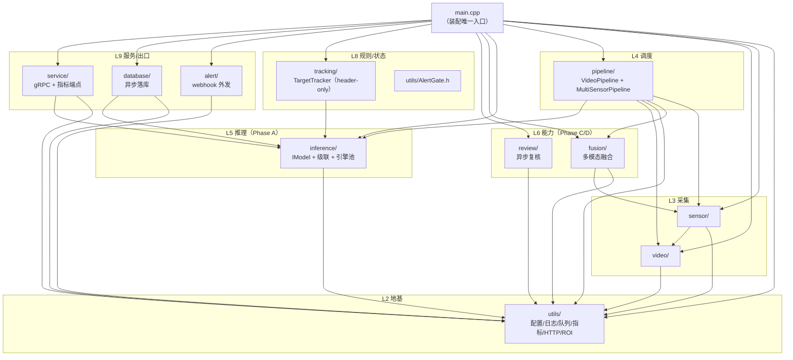

# CVInfer-Gate 依赖地图（文件级）

> **定位**：`READING_MAP.md` 讲"**怎么跑**"（运行周期），本文讲"**谁依赖谁**"（编译期依赖）。
> **数据来源**：脚本扫全仓 `#include "..."` / `#include <...>` 实测，非手绘。
> **复现命令**：
> ```bash
> python3 - <<'EOF'
> import os,re
> for dp,dn,fs in os.walk('src'):
>     for f in sorted(fs):
>         if not f.endswith(('.h','.cpp')): continue
>         p=os.path.join(dp,f)
>         for l in open(p,encoding='utf-8'):
>             m=re.match(r'\s*#include\s+"([^"]+)"',l)
>             if m: print('%s -> %s' % (p,m.group(1)))
> EOF
> ```

**口径**：
1. 只统计**项目内** `#include "..."`（165 条边，含 `tests/`）；`#include <...>` 只按**顶层库名**归并。
2. 生成代码（`inference.pb.h`、`review.grpc.pb.h` 等）算"外部"，单独列。
3. 行数为 2025 年注释清理**之后**的实测值。
4. **已知事实：头文件层依赖图无环（实测 0 环）**。

---

## §1 一张图



ASCII 版（同层级，箭头=依赖方向，实测无环）：

```
                    ┌──────────────────────── main.cpp ───────────────────────┐
                    │        （唯一装配点；所有模块在此被构造并互连）          │
                    └───┬────────┬────────┬────────┬────────┬────────┬─────────┘
                        │        │        │        │        │        │
   L9 服务/出口   service/   database/  alert/    │        │        │
                       │        │        │        │        │        │
   L8 规则/状态        │        │        │   tracking/  utils/AlertGate.h
                       │        │        │        │        │        │
   L6 能力            review/   │        │        │     fusion/      │
                       │        │        │        │        │        │
   L5 推理            inference/ ←── (tracking/database/service 只依赖它的 DetectionResult.h / IModel.h)
                       │        │        │        │        │        │
   L4 调度                │        │        │     pipeline/ ←──── fusion/ + sensor/
                       │        │        │        │        │        │
   L3 采集                │        │        │     video/ ←──────── sensor/
                       │        │        │        │        │        │
   L2 地基            └────────┴────────┴────────┴────────┴──→ utils/  ← 所有人都依赖它
```

---

## §2 模块级依赖矩阵（实测）

| 模块 | 文件数 | 行数 | 依赖的**项目内**模块 | 依赖的**外部库** | 被谁依赖 |
|---|---|---|---|---|---|
| `src/main.cpp` | 1 | 792 | 全部 11 个模块 + `*.pb.h` | gRPC++, OpenCV, 标准库 | — |
| `utils/` | 13 | 2 217 | **仅 `utils/` 自身** | yaml-cpp、OpenCV（`RoiUtils.h` 用 `cv::Rect2f`）、POSIX（socket/signal/fcntl/unistd）、标准库 | 所有模块 |
| `inference/` | 21 | 1 369 | `inference/` + `utils/` | **OpenVINO Runtime**、OpenCV | `pipeline`、`database`、`tracking`、`fusion`、`service`、`main`、单测 |
| `video/` | 5 | 519 | `video/` | OpenCV（`VideoCapture`/`VideoWriter`）、**FFmpeg**（`libav*`，RTSP） | `sensor/`、`pipeline`、`main` |
| `sensor/` | 8 | 560 | `sensor/` + `video/` + `utils/` | OpenCV | `pipeline`、`fusion`、`main`、自检/单测 |
| `pipeline/` | 4 | 519 | `pipeline/` + `utils/` + `inference/`(cpp) + `video/`(cpp) + `fusion/` + `sensor/` | OpenCV、标准库（线程/队列） | `main`、自检 |
| `fusion/` | 2 | 206 | `fusion/` + `sensor/` + `inference/DetectionResult.h` + `utils/` | 无直接第三方（OpenCV 经 `DetectionResult.h` 传递） | `pipeline`、自检/单测 |
| `tracking/` | 1 | 262 | `inference/DetectionResult.h` | OpenCV | `main`、单测 |
| `review/` | 5 | 481 | `review/` + `utils/` + `review.grpc.pb.h` | gRPC++, protobuf, OpenCV（ROI 裁剪） | `main`、自检、`review_client` |
| `database/` | 4 | 769 | `database/` + `utils/` + `inference/DetectionResult.h` | **MySQL Connector/C++**（`cppconn`） | `main` |
| `alert/` | 2 | 336 | `alert/` + `utils/` | 无（HTTP 由 `utils/HttpClient` 提供） | `main`、单测 |
| `service/` | 7 | 625 | `service/` + `utils/` + `inference/` + `*.pb.h` | gRPC++, protobuf, OpenCV, POSIX socket（内嵌指标 HTTP） | `main`、单测 |
| `tests/` | 3 + 12 | 876 + 2 291 | 被测模块 + `*.pb.h` | gtest、gRPC++、OpenCV、OpenVINO | — |

**外部库总清单**（`find_package` / `pkg_check_modules` 实测）：OpenCV · OpenVINO Runtime · Protobuf · **gRPC++（手动调 `protoc`/`grpc_cpp_plugin` 生成，不经 `find_package(gRPC)`）** · yaml-cpp · MySQL Connector/C++ · FFmpeg（`libavformat/libavcodec/libavutil/libswscale`）· GTest（仅测试）· POSIX（socket/signal）。

---

## §3 入度热点：改一个头文件，谁要重编

| 头文件 | 被包含次数 | 性质 |
|---|---|---|
| `utils/ConfigParser.h` | **19** | 配置 POD（`AppConfig/ModelConfig/…`）——**全项目最热**，改字段名会牵动所有模块 |
| `utils/Logger.h` | **18** | 日志单例宏 `CVLOG_*` |
| `inference/IModel.h` | 10 | 模型抽象 + 级联结果结构 |
| `sensor/ISensorSource.h` | 8 | 传感器抽象 + `SensorSample` |
| `inference/DetectionResult.h` | 7 | **跨模块数据契约**（`database`/`tracking`/`fusion`/`pipeline` 都读它） |
| `video/IVideoSource.h` | 5 | 视频源抽象 |
| `utils/Metrics.h`、`utils/ThreadSafeQueue.h`、`review/IReviewService.h`、`fusion/SensorFusion.h`、`sensor/ReplaySensorSource.h`、`inference/CascadeEngine.h` | 4 | 次级热点 |
| `utils/LifecycleCoordinator.h`、`review/ReviewScheduler.h`、`pipeline/MultiSensorPipeline.h`、`service/DetectionServiceImpl.h`、`service/MetricsServer.h`、`utils/RoiUtils.h`、`alert/AlertNotifier.h`、`inference.grpc.pb.h`、`utils/HttpClient.h`、`inference/InferenceEnginePool.h`、`inference/YoloPostProcessor.h` | 3 | — |

> **实操影响**：改 `ConfigParser.h` 的字段 = 重编 19 个翻译单元 + 跑 `test_config_parser`/`test_metrics`/`test_alert_notifier`/`test_sensor_fusion`/`phase_selftest`。
> 另：`CMakeLists.txt` 用 `file(GLOB_RECURSE SOURCES "src/*.cpp")`，**新增/删除 `.cpp` 必须重跑 `cmake`**，否则不进构建。

---

## §4 逐文件依赖明细（项目内）

### 4.1 `utils/`（13 文件）

| 文件 | 依赖（项目内） |
|---|---|
| `ConfigParser.h/.cpp` | 自身（`.cpp` → `.h`） |
| `Logger.h/.cpp` | `Logger.h` → `utils/ConfigParser.h` |
| `Metrics.h/.cpp` | 自身 |
| `ThreadSafeQueue.h` | **无**（叶子头，header-only 模板） |
| `HttpClient.h/.cpp` | 自身（POSIX socket 自实现） |
| `AlertGate.h` | **无**（叶子头，header-only） |
| `RoiUtils.h` | **无**（叶子头，唯一用 OpenCV 的 utils 头） |
| `LifecycleCoordinator.h/.cpp` | 自身 |

> 这是"**地基自包含**"的证据：`utils/` 的 6 条内部边全部指向自己，**没有一个 utils 文件 include 业务模块** → 任何模块都能安全依赖它。

### 4.2 `inference/`（21 文件）

| 文件 | 依赖（项目内） |
|---|---|
| `IModel.h` | `inference/DetectionResult.h`、`utils/ConfigParser.h` |
| `IInferenceEngine.h` | `utils/ConfigParser.h` |
| `OpenVINOEngine.h/.cpp` | `.h` → `IInferenceEngine.h` |
| `InferenceEnginePool.h/.cpp` | `.h` → `IInferenceEngine.h`、`utils/ConfigParser.h`；`.cpp` → `OpenVINOEngine.h` |
| `YoloPostProcessor.h/.cpp` | `.h` → `DetectionResult.h` |
| `YoloDetector.h/.cpp` | `.h` → `IModel.h`、`InferenceEnginePool.h`、`YoloPostProcessor.h` |
| `ClassificationPostProcessor.h/.cpp` | `.h` → `IModel.h` |
| `BehaviorClassifier.h/.cpp` | `.h` → `IModel.h`、`InferenceEnginePool.h`、`ClassificationPostProcessor.h` |
| `CascadeEngine.h/.cpp` | `.h` → `IModel.h`；`.cpp` → `utils/Logger.h`、`utils/RoiUtils.h` |
| `ModelFactory.h/.cpp` | `.h` → `IModel.h`；`.cpp` → `YoloDetector.h`、`BehaviorClassifier.h`、`utils/Logger.h` |
| `ModelPoolManager.h/.cpp` | `.h` → `IModel.h`、`utils/ConfigParser.h`；`.cpp` → `CascadeEngine.h`、`ModelFactory.h`、`utils/Logger.h` |
| `DetectionResult.h` | **无**（纯数据契约：13 字段 + `cv::Mat` ROI） |

> 依赖方向清晰：**`*.h` 只暴露抽象（`IModel.h`/`DetectionResult.h`），具体实现（`YoloDetector`/`OpenVINOEngine`/`BehaviorClassifier`）只在 `.cpp` 或工厂里被引用**。

### 4.3 `video/`（5）+ `sensor/`（8）

| 文件 | 依赖（项目内） |
|---|---|
| `video/IVideoSource.h` | **无**（抽象 + `VideoFrame`） |
| `video/FileVideoSource.h/.cpp` | `.h` → `IVideoSource.h` |
| `video/RtspVideoSource.h/.cpp` | `.h` → `IVideoSource.h`（FFmpeg 藏在 `.cpp`） |
| `sensor/ISensorSource.h` | `utils/ConfigParser.h` |
| `sensor/VideoSensorSource.h/.cpp` | `.h` → `ISensorSource.h`、`video/IVideoSource.h` |
| `sensor/ReplaySensorSource.h/.cpp` | `.h` → `ISensorSource.h`；`.cpp` → `utils/Logger.h` |
| `sensor/RadarSensorSource.h`、`InfraredSensorSource.h` | → `ReplaySensorSource.h`（复用回放实现） |
| `sensor/SensorSourceFactory.h` | `ISensorSource.h`、`RadarSensorSource.h`、`InfraredSensorSource.h` |

### 4.4 `pipeline/`（4）+ `fusion/`（2）+ `tracking/`（1）

| 文件 | 依赖（项目内） |
|---|---|
| `pipeline/VideoPipeline.h/.cpp` | `.h` → `DetectionResult.h`、`utils/LifecycleCoordinator.h`、`utils/ThreadSafeQueue.h`；`.cpp` → **`inference/IModel.h`、`video/IVideoSource.h`**（只依赖抽象，不认识 OpenVINO/FFmpeg） |
| `pipeline/MultiSensorPipeline.h/.cpp` | `.h` → `fusion/SensorFusion.h`、`sensor/ISensorSource.h`、`utils/ConfigParser.h`；`.cpp` → `utils/Logger.h` |
| `fusion/SensorFusion.h/.cpp` | `.h` → `DetectionResult.h`、`sensor/ISensorSource.h`、`utils/ConfigParser.h` |
| `tracking/TargetTracker.h` | `inference/DetectionResult.h` —— **header-only**（**262 行全在头里**，改它必须重编所有包含者） |

### 4.5 `review/`（5）+ `database/`（4）+ `alert/`（2）+ `service/`（7）

| 文件 | 依赖（项目内） |
|---|---|
| `review/IReviewService.h` | **无**（抽象 + 请求/结论结构） |
| `review/GrpcLlmReviewer.h/.cpp` | `.h` → **`review.grpc.pb.h`**、`IReviewService.h`、`utils/ConfigParser.h` |
| `review/ReviewScheduler.h/.cpp` | `.h` → `IReviewService.h`、`utils/ConfigParser.h`、`utils/ThreadSafeQueue.h` |
| `database/ConnectionPool.h/.cpp` | `.h` → `utils/ConfigParser.h` |
| `database/DBWriter.h/.cpp` | `.h` → `ConnectionPool.h`、`inference/DetectionResult.h`、`utils/ConfigParser.h`、`utils/ThreadSafeQueue.h` |
| `alert/AlertNotifier.h/.cpp` | `.h` → `utils/ConfigParser.h`、`utils/HttpClient.h` |
| `service/AuthGuard.h` | **无**（token/常量时间比较） |
| `service/DetectionServiceImpl.h/.cpp` | `.h` → **`inference.grpc.pb.h`**、`inference/IModel.h`、`service/AuthGuard.h`；`.cpp` → `utils/Logger.h`、`utils/Metrics.h` |
| `service/GrpcServerSetup.h/.cpp` | `.h` → `utils/ConfigParser.h`；`.cpp` → `DetectionServiceImpl.h`、`utils/Logger.h` |
| `service/MetricsServer.h/.cpp` | `.cpp` → `utils/Logger.h`（HTTP 自己套 socket，不依赖 gRPC/HttpClient） |

### 4.6 `main.cpp`（27 条内部 include）

`utils/{ConfigParser,Logger,LifecycleCoordinator,RoiUtils,AlertGate,Metrics}.h` · `video/{IVideoSource,FileVideoSource,RtspVideoSource}.h` · `inference/{IModel,CascadeEngine,ModelPoolManager}.h` · `pipeline/{VideoPipeline,MultiSensorPipeline}.h` · `sensor/{ISensorSource,SensorSourceFactory,VideoSensorSource}.h` · `fusion/SensorFusion.h` · `review/{IReviewService,GrpcLlmReviewer,ReviewScheduler}.h` · `tracking/TargetTracker.h` · `database/DBWriter.h` · `alert/AlertNotifier.h` · `service/{DetectionServiceImpl,GrpcServerSetup,MetricsServer}.h` · `inference.grpc.pb.h`

> **它是唯一同时认识"具体实现"的地方**（`FileVideoSource`/`RtspVideoSource`/`ModelPoolManager`/`GrpcLlmReviewer`/`DBWriter`…）。
> 其余所有模块都只通过抽象头交互 —— 这就是"换实现不改模块"的机制来源。

### 4.7 `tests/`

| 文件 | 依赖（项目内） | 外部 |
|---|---|---|
| `phase_selftest.cpp` | `utils/{ConfigParser,Logger}.h`、`inference/{IModel,CascadeEngine}.h`、`review/{IReviewService,ReviewScheduler}.h`、`sensor/{ISensorSource,ReplaySensorSource}.h`、`fusion/SensorFusion.h`、`pipeline/MultiSensorPipeline.h` | OpenCV（不用 gtest） |
| `test_grpc_client.cpp` / `test_review_client.cpp` | `inference.grpc.pb.h` / `review.grpc.pb.h` | gRPC++, OpenCV |
| `unit/test_config_parser.cpp` | `utils/ConfigParser.h` | gtest |
| `unit/test_logger_rotation.cpp` | `utils/Logger.h` | gtest |
| `unit/test_thread_safe_queue.cpp` | `utils/ThreadSafeQueue.h` | gtest |
| `unit/test_roi_utils.cpp` | `utils/RoiUtils.h` | gtest, OpenCV |
| `unit/test_alert_gate.cpp` | `utils/AlertGate.h` | gtest |
| `unit/test_metrics.cpp` / `test_metrics_server.cpp` | `utils/Metrics.h` / `service/MetricsServer.h` + `utils/HttpClient.h` | gtest, OpenCV |
| `unit/test_yolo_post_processor.cpp` | `inference/YoloPostProcessor.h` | gtest, OpenCV |
| `unit/test_sensor_fusion.cpp` | `fusion/SensorFusion.h`、`inference/DetectionResult.h`、`sensor/ISensorSource.h`、`utils/ConfigParser.h` | gtest, OpenCV |
| `unit/test_target_tracker.cpp` | `tracking/TargetTracker.h` | gtest, OpenCV |
| `unit/test_alert_notifier.cpp` | `alert/AlertNotifier.h` | gtest, OpenCV |
| `unit/test_auth_guard.cpp` | `service/AuthGuard.h` | gtest |

---

## §5 编译目标依赖（CMake 实测）

| 目标 | 组成 | 链接 |
|---|---|---|
| `CVInfer-Gate` | `file(GLOB_RECURSE "src/*.cpp")` + proto 生成源 | OpenCV · OpenVINO Runtime · yaml-cpp · protobuf · gRPC++(`PkgConfig::GRPC`) · **MySQL Connector/C++** · FFmpeg · pthread |
| `cv_unit_tests` | `tests/unit/*.cpp`（12 个） | OpenCV · `openvino::runtime` · yaml-cpp · `${CV_GTEST_MAIN}` · pthread；用 `gtest_discover_tests` 注册 |
| `phase_selftest` | `tests/phase_selftest.cpp` + 少量 `src/` | OpenCV（**不依赖 gRPC/MySQL/OpenVINO**） |
| `grpc_client` / `review_client` | `tests/test_*.cpp` + **复用生成的 pb 源** | OpenCV · protobuf · gRPC++ · grpc++ grpc gpr pthread |
| proto 生成 | `proto/inference.proto`、`proto/review.proto` → `protoc --grpc_out/--cpp_out` + `grpc_cpp_plugin`（**手写 `add_custom_command`，刻意绕过 `find_package(gRPC)`**） | — |

**耦合提醒**：`phase_selftest` 能秒级跑、无外部服务，正因为它**只链 OpenCV**；一旦你在 `phase_selftest.cpp` 里 include 了 `database/`/`service/`，它就会需要 MySQL/gRPC 才能链上 —— 这条"不链重库"的约束别破坏。

---

## §6 生成代码依赖（`.proto` 流向）

```
proto/inference.proto ──(protoc/grpc_cpp_plugin)──> build/inference.pb.{h,cc}
                                                     build/inference.grpc.pb.{h,cc}
        ├── src/service/DetectionServiceImpl.h   (服务端实现 gRPC 接口)
        ├── src/main.cpp                          (Health RPC 存根，--health-check)
        ├── tests/test_grpc_client.cpp
        └── 运行时对手：web_gateway/（Python grpcio 调 50051）

proto/review.proto ────(同一套生成逻辑)────────> build/review.pb.{h,cc} + review.grpc.pb.{h,cc}
        ├── src/review/GrpcLlmReviewer.h          (客户端)
        ├── tests/test_review_client.cpp
        └── 运行时对手：vlm_review/（Python 服务端，默认 50052）
```

> **改 proto 的影响面**：`proto/*.proto` → 重新生成 → 同时影响 `main.cpp`、`service/`、`review/`、两个 test 客户端、以及 Python 侧（`web_gateway/`、`vlm_review/`）。**proto 是本项目里"最跨语言"的接口**，改字段名要两边一起改。

---

## §7 依赖规则（实测成立，改代码时别破坏）

1. **`utils/` 谁都不依赖**（除自身）→ 它必须永远是最底层。查违规：
   `grep -rn '#include "' src/utils/ | grep -v 'utils/'`
2. **`inference/` 只依赖 `utils/`**；`video/`、`tracking/`、`fusion/` **绝不依赖 `pipeline/`**（单向）：`grep -rn '#include "pipeline' src/inference src/video src/tracking src/fusion`
3. **`pipeline/` 不认识"出口"**：它不 include `database/`、`alert/`、`service/` —— 落库/告警/gRPC 全部由 `main.cpp` 通过**回调**注入（`VideoPipeline::start(..., sink)`）。
4. **抽象头是接缝**：`video/IVideoSource.h`、`sensor/ISensorSource.h`、`inference/IModel.h`、`review/IReviewService.h` —— 上层 + 测试替身只依赖这 4 个，换实现（文件/RTSP、回放/真实传感器、OpenVINO/假模型、gRPC LLM/假复核）不改上层。
5. **只有 `main.cpp` 认识具体实现类**。新增子系统时，把具体类型的使用限制在 `main.cpp` 的装配块内。
6. **头文件层无环（实测 0 环）**；如果新增依赖后出现环，用前置声明 + 移到 `.cpp` 打破（本项目 `VideoPipeline.h` 第 18 行就是 `class IVideoSource;` 前置声明；`inference/IModel.h` 只在 `VideoPipeline.cpp` 里出现）。
7. **`tracking/TargetTracker.h` 是 header-only**：任何改动都会重编所有包含它的 TU。

---

## §8 常见改动的影响面（速查）

| 你要改 | 直接依赖者 | 必须回归 |
|---|---|---|
| `utils/ConfigParser.h` 字段 | 19 个 TU（所有模块） | 全量重编 + `test_config_parser`、`test_metrics`、`test_alert_notifier`、`test_sensor_fusion`、`phase_selftest` |
| `inference/DetectionResult.h` | 7 个 TU（`database`/`tracking`/`fusion`/`pipeline`/`service`/`test_sensor_fusion`） | `test_sensor_fusion`、`test_yolo_post_processor`、`test_target_tracker`、`phase_selftest` |
| `inference/IModel.h` | 10 个 TU（检测器/分类器/级联/引擎池/池管理/服务/管道/自检） | `phase_selftest`、`test_yolo_post_processor` |
| `video/IVideoSource.h` | 5 个 TU（File/Rtsp/Sensor/VideoPipeline/main） | 端到端跑一条 `file` 源 |
| `tracking/TargetTracker.h` | `main.cpp`、`test_target_tracker` | 该单测 |
| `proto/*.proto` | `main`、`service/`、`review/`、2 个 test 客户端、**Python 侧** | 重跑 `cmake`（重新生成）+ 起 `vlm_review` 与 `web_gateway` 联调 |
| 新增 `.cpp` | — | **必须重跑 `cmake`**（`GLOB_RECURSE` 不会自动感知） |
| 新增/改依赖边 | — | `ctest`（129 项）+ `phase_selftest`（52 项） |
