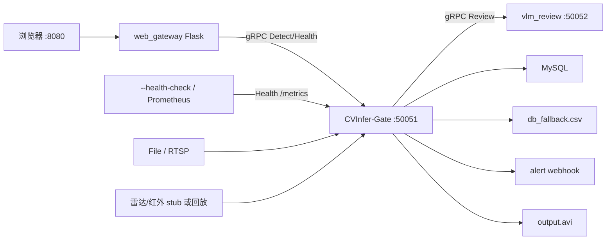

# CVInfer-Gate 项目总览（架构 + 现状）

> **本文档定位**：让新人**不用读 1500 行的 `PROJECT_NOTES.md`** 就能先看懂全局。
> 详细推导、实测数据、踩坑记录在 `PROJECT_NOTES.md`；本文只讲**结构**和**现状**。
>
> **口径声明**：本文基于已读到的源码、配置与 `PROJECT_NOTES.md` 记述整理。
> 笔记历史上出现过若干过时条目（见 §20.15 对账），因此**架构部分高置信，具体运行时细节以本机实际为准**。

---

## 0. 先理清：这里有 4 套编号系统

混乱的根源是它们混着用。先拆开：

| 编号 | 是什么 | 例子 |
|---|---|---|
| **Phase A/B/C/D** | **四个功能阶段**（横切能力，不是流水线步骤）| A 模型抽象、B 级联、C 复核、D 融合 |
| **P1-1 / P2-2** | **验收/待办编号**（某次验收清单里的条目）| 见 `PROJECT_NOTES` §14 一带 |
| **R-5 / R-9 / R-13** | **已知风险编号**（Risk）| R-5 = RTSP 断流不重连 |
| **§20.4 / §20.14** | **`PROJECT_NOTES.md` 的章节号** | §20.4 = DB 硬耦合 |

> **一句话：Phase 是"功能的名字"，P 是"验收的条目"，R 是"没修的坑"，§ 是"文档的章节"。**

另有**三条正交的线**，捋清这个就不乱了：

```
轴① 运行时数据流   —— 一条流水线，帧怎么流（§2）
轴② 四层抽象      —— Phase A–D，挂在流水线上的可插拔层（§4）
轴③ 开发里程碑    —— 记录"什么时候做了什么、修了什么坑"（见 PROJECT_NOTES）
```

---

## 1. 项目是什么

面向**图书馆/自习室占座**等场景（也通用安防/工地类合规检测）的**高性能 AI 推理网关**。

- 底层：**C++17 + OpenVINO**（纯 CPU 推理），手写 NMS，多线程流水线
- 对外：**gRPC + Protobuf** 微服务接口
- 前端：**Python Flask BFF**（`web_gateway/`，HTTP ⇄ gRPC 协议转换）
- 持久化：**MySQL**（异步批量写入 + 降级落盘）
- 可选增强：**级联复核 / 大模型异步复核 / 多模态融合 / 占座判定 / 目标跟踪**（默认可关，关掉与纯视觉链路行为一致）

**适用场景**：图书馆 / 自习室占座判定（默认）、安防 / 工地安全帽检测，以及任何「视频流 + 少量非视频传感器 + 需要落库 / 告警」的实时检测场景。
**目标人群**：想用 C++ 替换高并发 Python 推理后端的工程师 / 需要“模型 → 服务”闭环的算法同学 / 找参考实现的毕设与面试者 / 需要可插拔网关骨架的二次开发者。
**核心价值**：性能有据可依（FP32 天花板已量化到 ~33 fps）、架构可插拔（默认关闭即退化为纯视觉链路）、工程闭环完整（降级 / 不阻塞 / 可观测）、文档即资产。

---

## 2. 运行时全景（轴①：帧的一生）

```
┌──────────────┐   ┌────────────┐   ┌──────────────┐   ┌────────────────┐
│ 视频源        │   │ 解码线程    │   │ 线程安全队列   │   │ worker 线程池   │
│ File / RTSP  │──│ FFmpeg /   │──│ 有界·丢弃策略  │──│ N = config.    │
│              │   │ OpenCV     │   │ drop_oldest   │   │ worker_threads │
└──────────────┘   └────────────┘   └──────────────┘   └───────┬────────┘
                                                               │ 借引擎(池)
                                                               ▼
                                      ┌────────────────────────────────────────┐
                                      │ 推理层 (models[] 按 role 注册)           │
                                      │ 引擎池 → 预处理 → infer → 后处理(NMS)     │
                                      └───────────────────┬────────────────────┘
                                                          │ DetectionResult[]
                        ┌─────────────────────────────────┼──────────────────────────────┐
                        ▼ [Phase B: 可选]                 ▼ [Phase C: 可选]              ▼ [Phase D: 可选]
                  级联: 分类器二次确认            大模型异步复核(gRPC 客户端)      多模态融合(雷达/红外)
                        │                                 │                              │
                        └─────────────────┬───────────────┴──────────────────────────────┘
                                          ▼
                 ┌────────────────────────┼────────────────────────┐
                 ▼                        ▼                        ▼
        DBWriter(异步·批量)        result 视频(output.avi)       gRPC 服务(50051)
                 ▼
      MySQL    /   连不上 → db_fallback.csv (降级)
```

**线程清单**（"多线程流水线"的实际含义）：

| 线程 | 数量 | 职责 |
|---|---|---|
| main | 1 | 启动、装配、等待退出 |
| decode | 1 | 读帧 → 入队（`frame_interval` 抽帧 / `target_fps` 限速）|
| **worker** | `pipeline.worker_threads` | 借引擎 → 推理（**算力主体**）|
| DBWriter | 1 | 从队列批量取 → 写 MySQL / 落 CSV |
| gRPC server | `grpc.worker_threads`（0 = 默认）| 对外接口 |
| review worker | `review.worker_threads` | Phase C 异步调度 |
| signal watcher | 1 | `sigaction` + self-pipe 优雅关闭 |
| 传感器采样 | 每传感器 1 | Phase D 按 `rate_hz` 采样 |
| metrics HTTP | 1 | 拉式采集 `/metrics` / `/healthz`（默认关）|
| alert push | 1 | 告警 webhook 外发：有界队列 + 重试退避（默认关）|

**背压设计（关键正确点）**：队列**有界**（`max_size`）+ `drop_oldest` ⇒ 处理不过来时**丢旧帧**而不是无限堆积。
这是它能在有限算力下"压住实时线、不让延迟越积越大"的原因。

---

## 3. 代码结构

```
src/
├── video/      视频源抽象:  FileVideoSource(cv::VideoCapture) / RtspVideoSource(FFmpeg 直连)
├── pipeline/   流水线调度 + 有界队列（背压 / 抽帧）
├── inference/  OpenVINOEngine(引擎池) + YoloDetector(模型工厂) + YoloPostProcessor(NMS)
├── database/   DBWriter: 异步批量写 + 降级 CSV + 恢复后回传
├── alert/      告警外发: webhook（有界队列 / 重试退避 / 传输层可注入）
├── service/    gRPC 服务实现 + 鉴权拦截器 + /metrics 端点 + --health-check 探针
├── review/     Phase C: gRPC 客户端 + 异步调度（客户端在本仓库；服务端见 vlm_review/）
├── sensor/     Phase D: 传感器统一抽象（视频 / 雷达 / 红外）
├── fusion/     Phase D: 时间对齐 + 目标关联 + 加权置信度融合
├── tracking/   目标跟踪（IoU+质心兜底关联，输出 track_id）
├── occupancy/  [占座] 占座判定（静态座位 zone + 几何判据 + 时序状态机；**纯逻辑、不依赖模型**，可确定性单测）
└── utils/      线程安全队列、配置解析、LifecycleCoordinator(信号处理)、AlertGate(去重)、
               Logger(轮转) / Metrics(注册表) / HttpClient
```

**两个配置文件（唯一需要记住的配置入口）**：

| 文件 | 内容 |
|---|---|
| `config/config.yaml` | 视频源、线程、数据库、gRPC、各 Phase 开关 |
| `config/model_config.yaml` | **模型列表**，每项带 `role`（本项目抽象的核心）|

**运行配置模板**（互不影响，可随时回退）：

| 文件 | 用途 |
|---|---|
| `config/config.yaml` | 本地默认（file 源）|
| `config/config.rtsp.yaml` | RTSP 实时流 |
| `config/config.test.yaml` | 打开 Phase B/C/D + **占座** 跑真实链路（`cascade` / `review` / `fusion` / `occupancy` 均开启；复核需先起 `vlm_review/` 或 `scripts/mock_review_server.py`）|
| `config/config.ops.yaml` | **运维向**：file 源 + `metrics` 端点开启 + `alert.push` 指向 `scripts/alert_receiver.py`；不依赖 MySQL / 复核服务，用于验证可观测性与告警外发 |

---

## 3.5 进程与部署边界 · 推理抽象

> 本节并入原 `docs/项目架构梳理.md` 的独有内容（进程边界图 + 推理抽象）；其余章节与其重复，已删除。

**进程边界**：



`docker/docker-compose.yml` 一键拉起 `mysql-db` + `cv-infer-gate`（可再挂 web / vlm）；密钥走 `${VAR}` 展开，不进 yaml 明文。

**两条 proto 方向相反**：

| 契约 | 本仓库角色 | 端口 |
|---|---|---|
| `proto/inference.proto` | 服务端 | 50051 |
| `proto/review.proto` | 客户端 | 50052 |

**推理抽象（Phase A 的价值）**：

```text
model_config.yaml  role=detector/classifier
        │
        ▼
ModelPoolManager ──每模型── InferenceEnginePool ── OpenVINOEngine
        │
        ├── primaryDetector() → YoloDetector
        └── cascade.enabled → CascadeEngine(YoloDetector + BehaviorClassifier)
        │
        ▼
流水线 worker / gRPC Detect  只依赖 IDetector
```

换模型、开级联，不必改 `VideoPipeline` / `DetectionServiceImpl`。

---

## 4. Phase A–D 是什么（轴②：最容易搞混的地方）

它们是**挂在同一条流水线上的四个"可插拔能力层"**，**不是四个串行步骤**，各自可独立开关：

| Phase | 名字 | 干什么 | 现在的真实状态 |
|---|---|---|---|
| **A** | 模型抽象 | 用 `role`（detector / classifier / reviewer）+ 工厂，把"用什么模型"与"怎么调"解耦 | 🟢 **可用**（`model_config.yaml` 即它）|
| **B** | 级联 | 检测器只把**灰区**（conf 0.25~0.5）目标交二级分类器二次确认 | 🟡 **机制可跑**：`role=classifier` 注册样例见 `config/model_config.yaml` 注释块(与占座业务无关, 占座链路 `cascade.enabled=false`)；⚠**精度未回归**（改标签/阈值无自动报警）|
| **C** | 大模型异步复核 | 灰区目标送**外部 VLM**（gRPC），"确认才告警" | 🟢 **真 VLM 已跑通**：`vlm_review/` 服务端(OpenAI 兼容 / 本地 transformers / mock) + 本仓库 gRPC 客户端；已用 vLLM 起 `Qwen2-VL-2B-Instruct-AWQ` 端到端实测（真模型参与复核）；⚠**结论质量**（准确率）未定量评测 |
| **D** | 多模态融合 | 视频 + 雷达/红外：时间对齐 → 目标关联 → 加权置信度 | 🟢 **stub 雷达端到端通过**（`matched=66`）；带框传感器需换 `file` backend |

> **理解要点**：A 是**地基**，B/C/D 都是**建在 A 上的可选增强**。
> 关掉 B/C/D 时行为与纯视觉链路**完全一致** —— 这是设计约束，也是能上生产的正确做法。

---

## 5. 完成情况

| 层 | 状态 | 依据 |
|---|---|---|
| 架构重构 | 🟢 **可信** | 11 个架构级 BUG 全修（线程安全/启动时序/优雅关闭/背压/落库）+ **数据库降级 / RTSP 断流重连** |
| Phase A 模型抽象 | 🟢 **可信** | 已在跑 |
| Phase D 融合(stub) | 🟢 **可信** | 端到端 `matched=66` |
| MySQL 落库 | 🟢 **可信** | 表已建，正常写入，不再产生 `db_fallback.csv` |
| 自检 | 🟢 52/52 | `phase_selftest`，零外部依赖、秒级 |
| 单元测试 / CI | 🟢 **新增** | `ctest` = `cv_unit_tests`(gtest 194 例) + `phase_selftest`，共 195 项全绿；另有 **3 条零依赖自测 step**（`vlm_review` 鉴权拦截器、`web_gateway` 座位配置文本层、`static/app.js` 前端静态配平兜底 —— 后者不解析语法，只保证"文件没被改坏"）；GitHub Actions 每次 push/PR 自动跑（纯文档改动跳过）|
| 可观测性 / 告警外发 | 🟢 **新增** | `/metrics` 20 组指标（Prometheus 文本格式）+ `--health-check`（退出码 0/2/3/4/5）+ 告警 webhook 外发（实测 5/5 投递；死端口 `failed=3 retried=6` 不影响主链路）+ 日志按大小轮转；均默认关闭 |
| 性能 | 🟢 **已定档** | 30.2 ± 0.7 fps；FP32 天花板 ~33 fps（12 组配置验证）|
| Phase B 级联 | 🟡 **能跑通 / 精度未回归** | 分类器注册样例见 `config/model_config.yaml` 注释块(占座链路默认不开)；缺的是精度回归 |
| Phase C 复核 | 🟢 **真 VLM 已跑通** | `vlm_review/` 已提供；已接入真模型（vLLM + `Qwen2-VL-2B-Instruct-AWQ`）端到端跑通；结论质量未定量评测 |
| `web_gateway` | 🟢 **本地已联调** | 一键启动 `bash web_gateway/run.sh`（自动用/建 `.venv` + 缺依赖自动装）；单图检测（拖拽上传 / 无刷新结果 / 检测列表 / 点击行高亮框 / 下载结果图）+ **结果回看**（`GET /api/results` 产物清单、`GET /api/result-video` 按需转码并支持 Range 拖动、`GET /api/events` 日志事件）+ **座位标定**（`GET /api/seat-probe` 热力图与建议 zone；`GET/POST /api/seats` 网页点选 → 只改 `occupancy.seats` 那一段回写 YAML，候选配置交 C++ `--check-config` 判口径）+ **标定即时反馈**（P2：拖动中把这一区压到的物品/人落点摆出来，并把服务端 `dry_run` 判决原文点红、被点名的 zone 在画面里描红 —— 判定口径仍是 C++ 的，前端一条都没重写）。标定界面已在真实浏览器里打开过（P1 流程）；P2 的即时反馈已在浏览器里点过一遍：**当场揪出两处手柄名拼写错误**（`edHint` 应为 `editHint`、`edHeat` 应为 `editHeat` —— 语法合法、括号配平，静态配平查不出来；其中 `edHint` 炸在"配置已写盘成功"之后，页面报"请求失败"而文件其实改了），并顺着商家反馈修掉了本地提示的**口径误导**（计数看整段视频、底图只是首帧；抓不到物品标签时不怪 zone）。这两档现已分别由 `scripts/jscheck.py` 第二遍扫描（"用了但没声明"的名字）与 selfcheck 第 8 组契约守起来，但仍**没有真正的浏览器级自动化**（环境无 node，跑不了真语法检查/无头浏览器）—— 静态扫描只保证"名字对得上、文件没改坏"，交互效果仍靠人点 |
| 输出视频 | 🟡 **未回归** | 且只能在 RTSP 实时源下验证 |
| 数据库不可用 | 🟢 **已修** | 改为降级：写 `db_fallback.csv` + 后台按 `reconnect_interval_ms` 自动回连并在恢复后回传（启动只做 1 次快速连库）|
| RTSP 断流/关闭 | 🟢 **已修** | `interrupt_callback` 打断 `av_read_frame` + 读循环内指数退避重连（0.5s→8s），对上层透明 |
| **主干自动化测试** | 🔴 **未覆盖** | 已补 NMS/融合/配置/队列/ROI/去重/跟踪的单测，但**流水线 / 落库 / gRPC 服务**仍无自动化 |
| **目标跟踪 / 告警去重** | 🟡 **均已实现 / 无外观特征** | 告警去重 + `track_id`（IoU + 质心兼底，滑行/退休，**身份优先去重**）⇒ 逐帧重复告警基本消除；但无 re-ID 特征 ⇒ 遮挡/交叉后 ID switch 仍会重复一次，轨迹预测与停留/徘徊**告警规则**未做 |
| **占座判定（规则层）** | 🟡 **已实现 / 座位静态** | [占座] `src/occupancy/`：静态座位 zone + 几何判据（物品底边中点/包含度）+ 时序状态机（累计/暂停/复位/上升沿）+ M-of-N 投票，把"散落的 book/bag 框"变成"A-12 号座位：物品在、人不在，已持续 412 秒"的可解释结论，送 VLM 时带结构化证据；实测 `config.test.yaml`（图书馆视频）`occupied_events=2` → `submitted=2`，33 条单测。⚠座位 zone **是静态的**（机位会动则需先标定）、时基是**墙钟**（非帧时间戳）、无跨机位去重 |

**一句话账目：架构完备度高，真实资源验证覆盖率低。**


## 6. 一句话定位

> **一个"骨架已经是生产级、血肉还差工程化"的单机 AI 推理网关。**
> 架构设计（分层抽象 + 可插拔四层 + 有界队列背压）**超出多数同类个人项目**；
> 而**部署运维 / 安全**这两块尚未补齐（容错已补齐、测试自动化已起步、可观测性与告警外发已起步） —— 这正是它与"真项目"的主要距离。
> 性能这条线**已走到头**（FP32 天花板 ~33 fps），唯一剩下的性能杠杆是 **INT8**（换模型，非调代码）。

---

## 7. 相关文档

| 文档 | 内容 |
|---|---|
| `README.md` | 项目门面 + 验证状态表 |
| `PROJECT_NOTES.md` | 完整开发史、实测数据、踩坑记录、逐条设计决策 |
| `docs/READING_MAP.md` | **[新增] 文件级阅读地图**：文件 ↔ 架构层次 ↔ 运行周期（全 75 个 `src/` 文件的职责、真实日志串、线程/队列映射、变更影响表）|
| `PROJECT_NOTES.md` §20.12–§20.15 | 性能工程与收尾对账（本文的账目来源）|
| `docker/docker-compose.yml` + `docker/.env.example` + `config/config.docker.yaml` | **一键复现**：`cp docker/.env.example docker/.env`(填口令) + 仓库根放 `test.mp4` + `cd docker && docker compose up -d --build` ⇒ MySQL + C++ 网关(:50051) + Web 网关(:8080)；口令走 `.env` → yaml 里的 `${VAR}`，结果产物落 `cvinfer-output` 命名卷(gate 写 / web 读) |
| `scripts/schema.sql` | 数据库表结构（与 `docker/init_db.sql` 等价）|
| `vlm_review/` | Phase C 复核服务端（OpenAI 兼容 / 本地 transformers / mock 三后端）|
| `config/config.ops.yaml` + `scripts/alert_receiver.py` + `docker/prometheus.example.yml` | 可观测性三件套：开箱即跑的运维配置 / 伪下游接收端 / Prometheus 抓取配置 |
| `tests/unit/` | gtest 单元测试：NMS / 多模态融合 / 配置校验 / 线程安全队列 / ROI / 告警去重 / 目标跟踪 / 鉴权语义 / 占座规则状态机（[占座]） |
| `.github/workflows/ci.yml` | CI：编译 + `ctest`（push / PR；纯文档改动跳过，同分支旧跑自动取消）|
