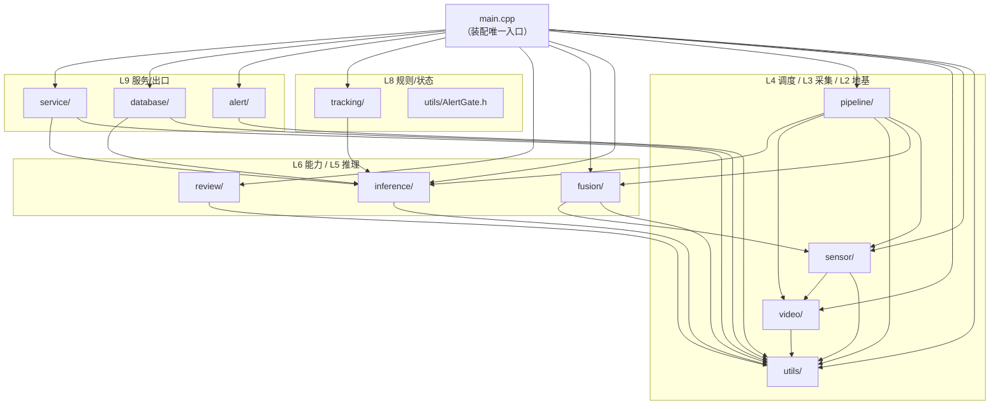

# CVInfer-Gate 阅读地图（文件 ↔ 架构层次 ↔ 运行周期）

> **定位**：`docs/OVERVIEW.md` 讲"系统长什么样"；本文讲"**每个文件在什么时候、对谁、起什么作用**"。
> **本文含两部分**：§1–§11 = 文件职责与运行周期；§12 = 编译依赖地图（并入原 `DEPENDENCY_MAP.md`）。
> **口径**：文件规模/符号取自本机实测（`src/` **75 文件 / 9 605 行**；`tests/` 4 022 行）；每个文件的作用引自**源码文件头的 banner**（**代码与其余文档已删除 `[Tn]` 标号**：任务编号现在只保留在 `PROJECT_NOTES.md` 中），未读到的细节不臆造。
> **本文不含代码改动**。编号术语（T / Phase A–D / § / R）见 `OVERVIEW.md` §0。

---

## 0. 三条使用路径

| 你的目的 | 走法 |
|---|---|
| 只想**跑起来** | §1 → §7 |
| 想**读懂主干** | §1 → §2（分层表）→ §4（时间线）→ §5（线程） |
| 想**改某个功能** | §8（变更影响表）→ 先看 §6 里对应的测试 |
| 想建立**全局直觉** | §3（四种契约）→ §4.1/4.2/4.3（周期三阶段）→ §9（易踩的坑） |

---

## 1. 一页全景：文件即架构

```
   ┌───────────── 运行周期（纵向：时间） ─────────────────────────────────────────────┐
   │                                                                                 │
   │  启动阶段                     稳态阶段                        关闭阶段            │
   │  （§4.1）                    （§4.2）                        （§4.3）            │
   │                                                                                 │
   │  main.cpp 装配      ┌──────── decode 线程 ────────┐         LifecycleCoordinator  │
   │      │              │   video/ ─► 有界队列        │                │             │
   │      │              │            pipeline/        │         main 固定顺序停机     │
   │      ▼              │            ▼               │                ▼             │
   │  utils/ConfigParser │      worker 线程 ×N         │      metrics→pipeline→fusion │
   │  utils/Logger       │      inference/ 借引擎推理   │      →alert(排空)→db(flush)  │
   │  utils/Lifecycle…   │            ▼               │      →signal                  │
   │  database/DBWriter     │    sink 线程: 融合→跟踪→占座  │                              │
   │  alert/AlertNotifier│      →去重→落库/画框/告警    │                              │
   │  inference/ 引擎池   │            ▼               │                              │
   │  review/ 客户端      │   ┌────────┴──────────┐    │                              │
   │  sensor/+fusion/     │   ▼        ▼          ▼    │                              │
   │  tracking/ occupancy/│ database/  alert/   service/│                              │
   │  service/Metrics…    │ (MySQL/CSV)(webhook) (gRPC) │                              │
   └──────────────────┬──────────────────────────────────────────────────────────────┘
                      │
   ┌──────────────────┴─────────── 架构层次（横向：职责） ───────────────────────────┐
   │ L1 契约      proto/ · inference/DetectionResult.h                              │
   │ L2 地基      utils/（ConfigParser Logger Lifecycle ThreadSafeQueue Metrics HttpClient AlertGate RoiUtils）│
   │ L3 采集      video/（IVideoSource File RTSP） · sensor/（ISensorSource 4 实现 + 工厂）│
   │ L4 调度      pipeline/（VideoPipeline 3 线程 · MultiSensorPipeline 轮询+融合编排）     │
   │ L5 推理      inference/（IModel IInferenceEngine 池 工厂 OV 实现 Yolo 后处理 级联）│
   │ L6 能力      PhaseB=CascadeEngine+BehaviorClassifier · PhaseC=review/ · PhaseD=fusion/ │
   │ L7 规则/状态 tracking/（TargetTracker）· occupancy/（SeatOccupancyAnalyzer）· utils/AlertGate.h │
   │ L8 出口      database/（DBWriter+ConnectionPool） · alert/（AlertNotifier）        │
   │ L9 服务      service/（DetectionServiceImpl GrpcServerSetup AuthGuard MetricsServer）+ main.cpp │
   │ 外围         config/ docker/ scripts/ web_gateway/ vlm_review/ .github/ docs/     │
   └────────────────────────────────────────────────────────────────────────────────┘
```

---

## 2. 分层文件总表（`src/` 全 75 个文件）

> 读法：**作用**列=它是什么；**上游调用者**=谁碰它（用来判断改它的影响范围）。

### 2.1 L2 地基：`utils/`（13 文件 / 2 217 行）—— 全项目最底层，谁都依赖它

| 文件 | 行 | 作用 | 上游调用者 |
|---|---|---|---|
| `ConfigParser.h/.cpp` | 342 / 678 | **系统运行配置**：新版分组结构（旧扁平结构仍可解析）+ `${VAR}` 环境变量展开 + **启动即校验**（非法配置拒绝启动） | `main.cpp`、所有单测的 config 部分 |
| `Logger.h/.cpp` | 99 / 186 | 分级日志（trace..error）+ 文件落盘 + **按大小轮转**（`log_max_size_mb`/`log_keep_files`，0=不轮转） | 全项目（`Logger::instance()`） |
| `LifecycleCoordinator.h/.cpp` | 87 / 149 | **生命周期协调器**：`sigaction` + self-pipe 收 SIGTERM/SIGINT；子对象 `registerChild()`；提供"该退出了"的唯一信号源 | `main.cpp`、`VideoPipeline`、`DBWriter`、`ReviewScheduler`、`MultiSensorPipeline` |
| `ThreadSafeQueue.h` | 177 | **有界队列**：容量 + 丢弃策略（`drop_oldest`/`block`）+ 统计 + 超时等待。**header-only 模板**，是"背压"这条不变量的唯一落点 | `VideoPipeline`、`DBWriter`、`AlertNotifier`、`ReviewScheduler`、`MultiSensorPipeline` |
| `Metrics.h/.cpp` | 82 / 165 | **指标注册表**：counter/gauge/labelled/拉式采集器 4 种形态 + Prometheus 文本格式渲染 | `main.cpp`、`DetectionServiceImpl`、`AlertNotifier`、`ReviewScheduler`、`TargetTracker`、`MetricsServer` |
| `HttpClient.h/.cpp` | 37 / 201 | **极简 HTTP/1.1 客户端**（仅为 webhook；带超时的 connect 是"连不上"最常见卡点） | `AlertNotifier` |
| `AlertGate.h` | 143 | **告警去重**：IoU 判定同一目标 + 冷却窗 + 有界记忆（`max_entries`）；**身份优先**（有 `track_id` 时按身份去重）。header-only | `main.cpp`（sink 回调） |
| `RoiUtils.h` | 106 | **ROI 外扩与裁剪** + **`cropContext()`**（占座/场景复核：以目标为中心扩成"物体所在场景"，而不是只裁一本书） | `CascadeEngine`、`main.cpp`（复核提交） |

### 2.2 L3 采集：`video/`（5 / 519）与 `sensor/`（8 / 560）

| 文件 | 行 | 作用 | 上游调用者 |
|---|---|---|---|
| `video/IVideoSource.h` | 23 | **视频源抽象**（open/read/close/分辨率） | `VideoPipeline`、`VideoSensorSource` |
| `video/FileVideoSource.h/.cpp` | 31 / 101 | 文件源（`cv::VideoCapture`），本地 mp4 跑通全靠它 | `main.cpp`（`source_type: file`） |
| `video/RtspVideoSource.h/.cpp` | 88 / 276 | RTSP 源：**FFmpeg 直连** + `interrupt_callback` 断开 `av_read_frame` + **读循环内指数退避重连（0.5s→8s）**，对上层透明 | `main.cpp`（`source_type: rtsp`） |
| `sensor/ISensorSource.h` | 94 | **统一传感器抽象**（video/radar/infrared 同一接口：带时间戳的目标列表） | `MultiSensorPipeline`、`SensorFusion` |
| `sensor/VideoSensorSource.h/.cpp` | 52 / 34 | 把旧 `IVideoSource` **适配**为统一传感器（**非拥有**适配器：open/close 仍由 main 负责） | `main.cpp`（融合开启时） |
| `sensor/RadarSensorSource.h` | 21 | **雷达骨架**（无硬件也能跑：stub） | 工厂 → `MultiSensorPipeline` |
| `sensor/InfraredSensorSource.h` | 20 | **红外骨架**（同上） | 同上 |
| `sensor/ReplaySensorSource.h/.cpp` | 76 / 226 | **文件回放/合成传感器**：用文本/合成数据喂融合链路（`scripts/sensor_replay_demo.txt` 即它的输入） | 工厂 → `MultiSensorPipeline` |
| `sensor/SensorSourceFactory.h` | 37 | 按 `sensors[]` 配置构建传感器（`kind`+`backend` → 实现） | `main.cpp` |

### 2.3 L4 调度：`pipeline/`（4 / 519）—— **帧的一生在此**

| 文件 | 行 | 作用 | 上游调用者 |
|---|---|---|---|
| `pipeline/VideoPipeline.h/.cpp` | 109 / 174 | **主干**：`decode` → 有界队列 → `worker`×N → `sink` 三线程；抽帧/限速；`start()/stop()`（幂等）/`stats()`；**sink 回调把结果交给 main 的业务回调** | `main.cpp` |
| `pipeline/MultiSensorPipeline.h/.cpp` | 89 / 147 | **多模态融合编排**：每传感器一个轮询线程（按 `rate_hz`）+ 缓冲；`fuse()` 由 **sink** 调用 ⇒ **停机必须晚于 `pipeline.stop()`** | `main.cpp`（sink 回调内） |

### 2.4 L5 推理：`inference/`（21 / 1 369）—— 抽象层（Phase A）的实体

| 文件 | 行 | 作用 | 上游调用者 |
|---|---|---|---|
| `inference/DetectionResult.h` | 33 | **跨模块数据契约**（见 §3.2）：13 个字段，**加法设计**（新能力=加带默认值的字段，对旧链路零影响） | 全链路 |
| `inference/IModel.h` | 86 | **抽象核心**：`IModel` / `IDetector` / `IClassifier` + `ModelRole{Detector,Classifier,Reviewer}` + `DetectStatus` + `Classification`。**Phase A 的"地基"就是这 89 行** | `ModelFactory`、`ModelPoolManager`、所有模型类 |
| `inference/IInferenceEngine.h` | 15 | **引擎接缝**（init/infer）——单测/替换后端靠它 | `InferenceEnginePool`、`OpenVINOEngine` |
| `inference/OpenVINOEngine.h/.cpp` | 18 / 153 | OpenVINO 实现（含 **分段计时**：预处理/推理每 100 帧打均值） | `InferenceEnginePool` |
| `inference/InferenceEnginePool.h/.cpp` | 72 / 82 | **引擎池**：借/还 + 超时（`grpc.timeout_ms` 亦作借用超时）；**worker 数=池大小** | `ModelPoolManager`、`DetectionServiceImpl` |
| `inference/ModelFactory.h/.cpp` | 17 / 34 | **模型工厂**：`role` → 造 `IDetector`/`IClassifier`/reviewer | `ModelPoolManager` |
| `inference/ModelPoolManager.h/.cpp` | 59 / 115 | **模型注册表**：读取 `model_config.yaml` 全部模型、按 role/name 提供；启动即打印"模型数=N" | `main.cpp`、`DetectionServiceImpl` |
| `inference/YoloDetector.h/.cpp` | 44 / 99 | **把"单模型链路"封装成 `IDetector`**（预处理→推理→后处理） | `ModelPoolManager` |
| `inference/YoloPostProcessor.h/.cpp` | 27 / 129 | **手写 NMS + 输出解码**（conf/nms 阈值）；后处理分段计时 | `YoloDetector` |
| `inference/CascadeEngine.h/.cpp` | 78 / 117 | **Phase B 级联**：实现 `IDetector`——主筛结果里**灰区**（`min_conf`~`max_conf`）目标送二级分类器 | `ModelPoolManager`（role=detector 且配了 classifier 时） |
| `inference/BehaviorClassifier.h/.cpp` | 42 / 65 | **二级分类器**：实现 `IClassifier`（含标签文件加载） | `CascadeEngine` |
| `inference/ClassificationPostProcessor.h/.cpp` | 31 / 53 | **分类后处理**：网络输出 → `Classification`（概率/标签） | `BehaviorClassifier` |

### 2.5 L6 能力：`review/`（5 / 481，Phase C）与 `fusion/`（2 / 206，Phase D）

| 文件 | 行 | 作用 | 上游调用者 |
|---|---|---|---|
| `review/IReviewService.h` | 62 | **复核服务抽象**（提交 ROI+prompt → 结论） | `ReviewScheduler`、`main.cpp` |
| `review/GrpcLlmReviewer.h/.cpp` | 51 / 162 | **gRPC 复核客户端**：连 `review.endpoint`(50052)、鉴权（`VLM_TOKEN`）、探活 deadline（`min(timeout,1500ms)`，避免拖慢启动） | `main.cpp` |
| `review/ReviewScheduler.h/.cpp` | 84 / 122 | **异步复核调度**：有界队列 + `worker_threads` 线程 + 超时/不可用 → **兜底告警**（`alert_on_failure`）；结论按 `frame_seq` 回投 | `main.cpp` |
| `fusion/SensorFusion.h/.cpp` | 63 / 143 | **决策级融合**：时间对齐（`time_tolerance_ms`）→ 目标关联（`match_iou`）→ 加权置信度（`sensor_weight`）；回写 `fused/vision_confidence/sensor_confidence/distance_m` | `MultiSensorPipeline::fuse()` |

### 2.6 L7 规则/状态 与 L8 出口

| 文件 | 行 | 作用 | 上游调用者 |
|---|---|---|---|
| `occupancy/SeatOccupancyAnalyzer.h/.cpp` | 189 / 354 | **占座判定（规则层）**：静态座位 zone + 几何关系（物品归属/人在不在用）+ 时序状态机（累计/暂停/复位/上升沿）+ M-of-N 投票；**纯逻辑、不依赖模型**，可确定性单测 | `main.cpp`（sink 回调，紧跟跟踪） |
| `tracking/TargetTracker.h` | 262 | **目标跟踪**：IoU + 质心兜底关联、滑行/退休、`track_id` **单调递增且永不复用**（复用会让去重误判）。header-only | `main.cpp`（sink 回调，紧跟融合） |
| `database/ConnectionPool.h/.cpp` | 70 / 115 | **连接池**（`database.pool_size`） | `DBWriter` |
| `database/DBWriter.h/.cpp` | 134 / 450 | **异步批量落库**：攒 `batch_size` 或 `flush_interval_ms` 冲刷；**不可用→`fallback_path` CSV 降级 + 按 `reconnect_interval_ms` 回连 + 恢复后回传**；启动只做 1 次快速连库（不再阻塞） | `main.cpp` |
| `alert/AlertNotifier.h/.cpp` | 105 / 231 | **告警外发**：有界队列 + 独立线程、重试指数退避（≤5s）、退避可被打断、停机排空（`drain_timeout_ms`）、统计（`pushed/sent/failed/dropped/retried`）；`Transport` 可注入（单测不碰网络） | `main.cpp` |

### 2.7 L9 服务：`service/`（7 / 625）+ 顶层 `main.cpp`

| 文件 | 行 | 作用 | 上游调用者 |
|---|---|---|---|
| `service/DetectionServiceImpl.h/.cpp` | 41 / 118 | **gRPC 业务实现**：`Detect`（借引擎推理）/`Health`（返 `version/uptime_ms/detector`）；RPC 计数（`method`/`code` 标签） | `GrpcServerSetup`、`tests/test_grpc_client.cpp` |
| `service/GrpcServerSetup.h/.cpp` | 24 / 50 | **服务端装配**：超时/消息上限（16MB）/keepalive/线程数 + 注册服务 + **挂鉴权拦截器** | `main.cpp` |
| `service/AuthGuard.h` | 134 | **主服务(50051)鉴权**：校验 `authorization: Bearer <token>`，未授权回 `UNAUTHENTICATED`（实测退出码/指标可见）；token 空=不鉴权 | `GrpcServerSetup` |
| `service/MetricsServer.h/.cpp` | 63 / 195 | **指标端点**：极简 HTTP/1.1，只服务 `/metrics` 与 `/healthz`；`bind`+`port` 可配（默认 `0.0.0.0:9100`，无鉴权） | `main.cpp` |
| `main.cpp` | 980 | **唯一的装配中心 + 生命周期 + 业务规则中枢**：解析参数（含 **`--health-check` 探针就实现在这里**，不是单独文件）→ 按固定顺序 init 各子系统 → sink 回调内的处理顺序（§4.2）→ 按固定顺序停机 + 打印各阶段统计 | 进程入口 |

### 2.8 外围（不在 `src/`，但决定"能不能跑/怎么跑"）

| 文件/目录 | 行 | 作用 |
|---|---|---|
| `proto/inference.proto` | 47 | 主服务契约：`Detect`、`Health`（`DetectionService`） |
| `proto/review.proto` | 50 | 复核服务契约：`Review`、`Health`（`ReviewService`） |
| `config/config.example.yaml` | 201 | **唯一模板**（不含口令，`${VAR}` 占位）：11 段（**含 `cascade:` / `occupancy:`**）；注意其 `video.source_type` 默认是 **rtsp** |
| `config/config.ops.yaml` | 108 | **运维向**：file 源 + `metrics` 开 + `alert.push` 指向脚本；不依赖 MySQL/复核 |
| `config/config.rtsp.yaml` / `config.test.yaml` | 149/219 | RTSP 实时流 / **打开 Phase B+C+D + 占座** 的真实链路（`config.test.yaml` 默认开 `occupancy` 并带一个可跑的座位） |
| `config/config.yaml` | 106 | 本机默认配置（**被 `.gitignore`，不在仓库**：必须自己 `cp`） |
| `config/model_config.yaml` | 53 | **模型清单**（每项带 `role`）——Phase A 的输入 |
| ~~`config/{cascade,review,sensors}.example.yaml`~~ | — | 原有三个**分段模板**（35/57/60 行），2026-10-02 已合并进 `config.example.yaml` 并删除 |
| `docker/Dockerfile` / `docker-compose.yml` | 44/127 | 4 个服务：`mysql-db`、`cv-infer-gate`（含 healthcheck）、`vlm-review`、网络 |
| `docker/init_db.sql` / `scripts/schema.sql` | 20/45 | 表结构（两者等价） |
| `docker/prometheus.example.yml` | 43 | **Prometheus 抓取配置** |
| `scripts/alert_receiver.py` | 131 | **伪下游**：收 webhook 并逐条打印（验证告警外发） |
| `scripts/mock_review_server.py` | 176 | 规则版复核服务端（跑通 Phase C 不花钱） |
| `scripts/{bench,stack_probe,thread_probe}.sh` | 80/73/78 | 性能基准 / 栈探测 / 线程探测（性能工程遗留工具） |
| `web_gateway/`（`app.py` + `templates/index.html` + `static/{style.css,app.js}` + 生成桩 `*_pb2*.py`） | —（app.py + 2 静态资源 + 模板） | Flask BFF：HTTP ⇄ gRPC（含 token 透传）。前端为独立模板/静态资源：页面走 `POST /api/detect`（JSON：带框图 dataURL + 检测列表）、`GET /api/status`（TCP 探活徽标）；旧 `POST /detect`（带框 JPEG）保留兼容 |
| `vlm_review/*.py` | 1 070 | Phase C 服务端（OpenAI 兼容 / 本地 transformers / mock 三后端 + 鉴权拦截器 + 自测） |
| `tests/unit/*.cpp`（13 个） | 3 147 | 单测（见 §6） |
| `tests/phase_selftest.cpp` | 584 | 零依赖自检（**52 项**，秒级；ctest 记得它 1 项）|
| `tests/test_grpc_client.cpp` / `test_review_client.cpp` | 119/173 | 真连服务的联调客户端 |
| `.github/workflows/ci.yml` | 105 | 编译 + `ctest`（纯文档改动跳过） |
| `README.md` / `docs/OVERVIEW.md` / `PROJECT_NOTES.md` | 300/232/1664 | 门面 / 结构现状 / 开发史与踩坑 |

---

## 3. 四种跨模块契约（读代码时"钱"在哪流动）

### 3.1 配置契约（`config/*.yaml` → `utils/ConfigParser`）

| 段 | 关键键 | 谁消费 |
|---|---|---|
| `app` | `log_level`、`log_file`、`log_max_size_mb`、`log_keep_files` | `Logger` |
| `video` | `source_type`、`source_path`、`target_fps`、`frame_interval`、`queue.max_size/policy` | `main.cpp`→`video/`、`VideoPipeline` |
| `pipeline` | `worker_threads`（=引擎池大小=worker 数） | `ModelPoolManager`、`VideoPipeline` |
| `database` | `pool_size`、`batch_size`、`flush_interval_ms`、`fallback_path`、`reconnect_*` | `DBWriter`、`ConnectionPool` |
| `alert.dedup` | `iou`、`cooldown_ms`、`max_entries` | `utils/AlertGate` |
| `alert.push` | `enabled`、`url`、`max_retries`、`retry_backoff_ms`、`max_queue`、`drain_timeout_ms`、`header_*` | `alert/AlertNotifier` |
| `grpc` | `port`、`timeout_ms`、`max_message_size_mb`、`keepalive_time_ms`、`auth_token` | `GrpcServerSetup`、`AuthGuard`、`DetectionServiceImpl` |
| `metrics` | `enabled`、`bind`、`port` | `service/MetricsServer` |
| `review` | `endpoint`、`timeout_ms`、`worker_threads`、`trigger{}`、`roi_padding`、`prompt`、`alert_type`、`alert_on_failure` | `ReviewScheduler`、`GrpcLlmReviewer`、`main.cpp` |
| `sensors[]` / `fusion` | `kind/backend/rate_hz/labels` / `time_tolerance_ms/match_iou/sensor_weight/...` | `SensorSourceFactory`、`MultiSensorPipeline`、`SensorFusion` |
| `occupancy` | `enabled`、`seats[]`(name/polygon/rect)、`item_labels`、`t_occupied_ms`、`t_grace_ms`、`vote_n/vote_m`、`item_seat_overlap`、`item_person_overlap`、`person_seat_iou`、`min_person_height_px` | `occupancy/SeatOccupancyAnalyzer`、`main.cpp` |
| `tracking` | `iou`、`min_hits`、`max_age_ms` | `TargetTracker` |

> **开关清单（"默认关"的四个 + 两个默认开的）**：`alert.push.enabled=false`、`metrics.enabled=false`、`occupancy.enabled=false`、`tracking/dedup` 默认关或等价旧行为；`fusion.enabled`、`review.enabled` 在 **示例** 里是 true（为演示 Phase C/D，注意这与"内部默认"不同）。

### 3.2 数据契约 `inference/DetectionResult.h`（13 字段，谁写谁读）

| 字段 | 谁回写 | 谁读 |
|---|---|---|
| `class_id`/`confidence`/`box`/`label` | `YoloDetector`（主筛） | 全链路 |
| `reviewed`/`sub_class_id`/`sub_confidence`/`sub_label` | `CascadeEngine`（灰色判断后） | 画框、落库、告警文案 |
| `fused`/`vision_confidence`/`sensor_confidence`/`distance_m` | `SensorFusion`（sink 最前置） | 画框、落库、告警 |
| `track_id` | `TargetTracker`（sink，融合之后） | `AlertGate`（身份优先去重）、画框（`#id`）、落库 |

> **设计原则（很重要）**：每次新增能力都是**加带默认值的字段** ⇒ 未启用的链路行为**逐字节不变**。⚠但 `track_id` **没有进 proto** ⇒ gRPC 响应里看不到它。

### 3.3 协议契约（`proto/`）

| RPC | 服务 | 实现方 | 调用方 |
|---|---|---|---|
| `Detect` | `DetectionService` @50051 | `service/DetectionServiceImpl.cpp` | `web_gateway/`、`tests/test_grpc_client.cpp` |
| `Health` | `DetectionService` @50051 | 同上 | `--health-check`（在 `main.cpp`）、compose healthcheck |
| `Review` | `ReviewService` @50052 | `vlm_review/server.py`（或 mock/真 VLM） | `review/GrpcLlmReviewer.cpp`、`tests/test_review_client.cpp` |
| `Health` | `ReviewService` @50052 | 同上 | `GrpcLlmReviewer` 的 init 探活（`review.health_check`） |

### 3.4 可观测契约（日志关键词 ↔ 模块；20 组指标）

| 日志关键词（**逐字取自源码**） | 打印处 |
|---|---|
| `=== CVInfer-Gate 启动 ===` / `服务就绪, 按 Ctrl+C 退出。` / `正在关闭服务...` / `已安全退出。` | `main.cpp`（219/703/707/788）|
| `系统配置加载成功` / `配置校验失败` / `模型配置加载成功 (模型数=N)` | `utils/ConfigParser` |
| `[ModelPoolManager] 初始化完成, 模型数: N` / `使用检测器: <name>` | `inference/ModelPoolManager` / `main.cpp:344` |
| `视频帧率: 源=…fps, frame_interval=…` / `原视频分辨率: WxH` | `main.cpp`（315/434）|
| `告警去重: 已启用 (iou=…)` / `目标跟踪: 已启用 (iou=…)` | `main.cpp`（458/478）|
| `告警推送: 已启用 -> <url>` / `告警推送: 已禁用(仅落库…)` / `[告警推送] 队列已满(N), 丢弃最旧告警` | `main.cpp`（248/254）/ `alert/AlertNotifier.cpp:82` |
| `gRPC 服务已启动, 监听: <addr>`（同行附 `auth=on\|off`）| `main.cpp:607` / `service/GrpcServerSetup.cpp` |
| `指标端点: 已禁用(metrics.enabled=false)` / `[指标] /metrics 端点已启动, 端口 N` | `main.cpp:686` / `service/MetricsServer` |
| `[health-check] OK addr=… version=… uptime_ms=… <detail>` | `main.cpp:192`（`--health-check`）|
| `[RtspVideoSource] RTSP 流打开成功: <url>` / `读流中断(…), 开始重连...` / `重连尝试 #N` / `重连成功(累计 N)` | `video/RtspVideoSource.cpp` |
| `[DBWriter] 数据库不可用, 以【降级模式】启动: 记录先落本地 <path>` | `database/DBWriter.cpp:41` |
| **关闭时的汇总（`main.cpp:716~790`；稳态期没有任何心跳日志 —— 这是"可观测性 65%"的字面含义）**：`流水线统计: decoded/dropped/processed/emitted`、`级联统计: primary/triggered`、`复核统计: submitted/dropped`、`融合统计: frames/…`、`告警去重统计: allowed/suppressed`、`目标跟踪统计: frames/spawned/retired/active/matched/longest_dwell`、`占座统计: frames/seats/occupied_events` + 逐座位快照、`告警推送统计: pushed/sent/failed/dropped/retried[ last_error=…]`、`结果视频已保存至 output.avi`、`日志轮转次数: N` | `main.cpp` |

指标→注册点的真相：20 组指标在 `main.cpp:615~676` 用 `reg.addCollector(...)` **集中注册**（lambda 去拉各模块的值）；唯一例外是 `cvinfer_grpc_requests_total`，由 `service/DetectionServiceImpl.cpp:19` 直接 `Registry::instance().inc(name, labels)` 累加。`/metrics` 的渲染回调在 `main.cpp:681` 交给 `MetricsServer`。

---

## 4. 运行周期时间线

### 4.1 启动（`main.cpp` 行号为锚点，可跳读）

| 序 | `main.cpp` | 动作 | 涉及文件 | 现场日志关键词 |
|---|---|---|---|---|
| 0 | 160–212 | **`--health-check` 提前返回**（一次性探针，不加载模型/不连库） | `main.cpp`（gRPC Health 存根） | `[health-check] OK addr=… version=… uptime_ms=… detector=…` |
| 1 | 215 | 日志系统 | `utils/Logger` | `日志轮转已开启: …`（若配了上限） |
| 2 | 224 | 信号/生命周期 | `utils/LifecycleCoordinator` | — |
| 3 | 239 | 数据库（**1 次快速连库**，失败即降级不阻塞） | `database/DBWriter`+`ConnectionPool` | `[DBWriter] 数据库不可用, 以【降级模式】启动: 记录先落本地 <path>` |
| 4 | 247 | 告警外发（若开） | `alert/AlertNotifier` | `告警推送: 已启用 -> …` |
| 5 | 283/285 | 视频源 | `video/FileVideoSource`/`RtspVideoSource` | `[RtspVideoSource] RTSP 流打开成功: <url>` |
| 6 | 322 | 模型与引擎池（=`worker_threads`） | `inference/*` | `模型配置加载成功 (模型数=N)`、`使用检测器: …` |
| 7 | 352/374 | 复核客户端 + 调度器（若开） | `review/*` | 探活结果 |
| 8 | 405/411 | 传感器 + 融合编排（若开） | `sensor/*`、`pipeline/MultiSensorPipeline` | `融合统计` 启动行 |
| 9 | 507/577 | 目标跟踪 + 占座判定（若开） | `tracking/TargetTracker`、`occupancy/SeatOccupancyAnalyzer` | `占座判定: 已启用 (座位数=N, 物品类别=[…], t_occupied=…s, t_grace=…s, vote=m/n)` + 逐座位区域 |
| 10 | 678 | 指标端点（若开） | `service/MetricsServer` | `[指标] /metrics 端点已启动, 端口 9100` |
| 11 | 687 | gRPC 服务线程 | `service/GrpcServerSetup`+`AuthGuard`+`DetectionServiceImpl` | `gRPC 服务已启动, 监听: <addr>`（同行附 `auth=on\|off`）|
| 12 | 694 | **流水线启动（此后开始出帧）** | `pipeline/VideoPipeline` | `服务就绪, 按 Ctrl+C 退出。`（**稳态期无心跳日志**；统计只在关闭时汇总打印）|

### 4.2 稳态：帧的一生（逐跳文件 + 处理顺序）

```
video/Rtsp·File  ──►  VideoPipeline::decodeLoop   （frame_interval/target_fps）
                          │  ThreadSafeQueue<h>[max_size, drop_oldest]
                          ▼
                    VideoPipeline::workerLoop ×N   （借 inference/InferenceEnginePool；
                          │                           YoloDetector→YoloPostProcessor(NMS)
                          │                           灰区 → CascadeEngine→BehaviorClassifier）
                          ▼
                    VideoPipeline::sinkLoop   ──►  main.cpp 的业务回调（**顺序即语义**）：
                          (0)  fusion/MultiSensorPipeline::fuse()   ← 需要融合时（拷贝后改写）
                          (0.5) tracking/TargetTracker::update()    ← 融合之后（传感器补的目标也有 id）
                          (0.8) occupancy/SeatOccupancyAnalyzer::update()  ← 有状态, 且**必须在"无检测早退"之前**（累计时长靠它推进）
                          (1)  画框/写 output.avi（不等复核，实时）
                          (2)  review/ReviewScheduler::submit()     ← 灰区目标异步复核
                          (3)  utils/AlertGate::allow()             ← 去重（身份优先）
                          (4)  database/DBWriter::enqueue() + alert/AlertNotifier::notify()
                          (5)  复核结论回来 → 可能再补一条告警（兜底/确认）
```
同时**旁路**：`service/DetectionServiceImpl::Detect`（按帧号找结果）与 `MetricsServer`（拉式 `/metrics`）。

### 4.3 关闭（顺序即正确性）

> 源码注释原文（`main.cpp:706`）：**顺序 = gRPC → 指标 → 流水线 → 告警推送 → 数据库**。

| 序 | 行号 | 动作 | 为什么在这个位置 |
|---|---|---|---|
| 1 | 704 | 打印 `正在关闭服务...` | 让 "正在退出" 可见 |
| 2 | 706 | `grpc_thread.join()` | 先断对外入口，不再接受新 RPC |
| 3 | 709 | `metrics_server.stop()` | **必须最先停端点**（注释：之后的析构会让 collector 持有的对象逐个消失，不能再被抓取）|
| 4 | 714 | `pipeline.stop()`（关队列 + join decode/worker/sink；幂等） | 先停**生产者**，此后不再有新的 sink 调用 |
| 5 | 719~769 | 打印 `流水线统计` / `级联统计` / `复核统计` / `融合统计` / `告警去重统计` / `目标跟踪统计` | 每个子系统 "最后的账" |
| 6 | 735 一带 | `review_scheduler->stop()` | 复核回调也会 `raise_alert`，必须早于告警停机 |
| 7 | 741 | 融合统计/停机 | **必须晚于 `pipeline.stop()`**：`fuse()` 由 sink 调用（源码注释写明） |
| 8 | 773 | `alert_notifier.stop()`（排空，有超时） | 已无新告警，尽量把队列发完 |
| 9 | 777 | `db_writer.flush()` + `stop()` | 数据最后落盘 |
| 10 | 786~791 | 关视频源 → `结果视频已保存至 output.avi` → `日志轮转次数: N` → `已安全退出。` | 收尾宣告 |
| 11 | 786 | `signal_watcher.stop()` | 最后收掉信号源 |

### 4.4 三条不变量（对应文件，改代码时别破坏）

| 不变量 | 落点文件 |
|---|---|
| ① 跨线程只走**有界队列 + 明确丢弃策略** | `utils/ThreadSafeQueue.h`（帧/告警/复核/落库四处用） |
| ② 可插拔能力**默认关**，关掉=纯视觉链路 | `ConfigParser`（默认值）+ `main.cpp`（`if (xxx)` 装配块） |
| ③ 出口**不阻塞主链路且可降级** | `database/DBWriter`（批量+CSV）、`alert/AlertNotifier`（队列+重试）、`review/ReviewScheduler`（超时→兜底） |

---

## 5. 线程 × 文件 × 队列

| 线程族 | 数量 | 创建处 | 输入队列 | 去向 |
|---|---|---|---|---|
| decode | 1 | `pipeline/VideoPipeline.cpp:42` | 无（读视频源） | 帧队列（有界） |
| worker | `pipeline.worker_threads` | `VideoPipeline.cpp:45`（`workers_.emplace_back`） | 帧队列 | sink 回调 |
| sink | 1 | `VideoPipeline.cpp:47` | worker 结果 | §4.2 的 (0)~(5) |
| DBWriter | 1 | `database/DBWriter.cpp:56` | 落库队列（`batch_size*16`） | MySQL / CSV |
| gRPC | gRPC 内部池 | `main.cpp:690` | — | `Detect`/`Health` |
| 复核 worker | `review.worker_threads` | `review/ReviewScheduler.cpp:33` | 复核队列（`queue_size`） | 50052 / 兜底告警 |
| 告警推送 | 1 | `alert/AlertNotifier.cpp:53` | 告警队列（`max_queue`） | webhook |
| 指标 HTTP | 1 | `service/MetricsServer.cpp:114` | — | `/metrics`、`/healthz` |
| 传感器轮询 | 每传感器 1 | `pipeline/MultiSensorPipeline.cpp:31` | — | 融合缓冲 |
| 信号监听 | 1 | `utils/LifecycleCoordinator.cpp:106` | self-pipe | 通知 `main` 停机 |

---

## 6. 测试 ↔ 被测文件（`tests/unit/` 13 文件 / 179 例 + 3 个端到端工具）

| 测试文件 | 例 | 被测文件 |
|---|---|---|
| `test_config_parser.cpp` | 821 | `utils/ConfigParser`（含校验/`${VAR}`/降级） |
| `test_seat_occupancy.cpp` | 513 | `occupancy/SeatOccupancyAnalyzer`（几何判据 C1/C1b/C2 + 时序状态机 C3/C4/C5/C6 + 时基不变量） |
| `test_alert_gate.cpp` | 191 | `utils/AlertGate` |
| `test_sensor_fusion.cpp` | 308 | `fusion/SensorFusion` |
| `test_target_tracker.cpp` | 201 | `tracking/TargetTracker` |
| `test_yolo_post_processor.cpp` | 202 | `inference/YoloPostProcessor`（NMS） |
| `test_auth_guard.cpp` | 133 | `service/AuthGuard` |
| `test_roi_utils.cpp` | 75 | `utils/RoiUtils` |
| `test_alert_notifier.cpp` | 197 | `alert/AlertNotifier`（重试/丢弃/排空，注入 `Transport`） |
| `test_thread_safe_queue.cpp` | 110 | `utils/ThreadSafeQueue` |
| `test_metrics.cpp` | 97 | `utils/Metrics` |
| `test_logger_rotation.cpp` | 123 | `utils/Logger`（轮转） |
| `test_metrics_server.cpp` | 93 | `service/MetricsServer`（HTTP 真连） |
| `phase_selftest.cpp` | **52 项**（ctest 记 1 项） | NMS/融合/配置/队列/ROI 等 "零依赖自检"（Phase A~D 行为全演一遍）|
| `test_grpc_client.cpp` / `test_review_client.cpp` | — | 真连 50051 / 50052（需服务在跑） |

---

## 7. 最小可跑（3 条命令 + 你应该看到什么）

```bash
# ① 行为自检（零依赖，秒级）—— 一次看全 Phase A~D
./build/phase_selftest                 # 期望末行: ===== 结果: 52 项通过, 0 项失败 ===== ，退出码 0

# ② 单元测试 —— 最快的"行为规格书"
cd build && ctest --output-on-failure  # 期望: 180/180 通过

# ③ 真跑一条链路 + 看可观测面（不需要 MySQL / 复核服务）
python3 scripts/alert_receiver.py --port 8899            # 终端A: 期望打印监听信息
cd build && ALERT_TOKEN=demotoken ./CVInfer-Gate --config config/config.ops.yaml   # 终端B
curl -s http://127.0.0.1:9100/metrics | head -40         # 期望: 20 组 cvinfer_* 指标
./build/CVInfer-Gate --health-check=127.0.0.1:50051      # （服务在跑时）期望: [health-check] OK addr=… version=… uptime_ms=… <detail> ，退出码 0
```
> ⚠`config.ops.yaml` 用的是 **file** 源，需要 `build/test.mp4`（构建时自动拷贝；缺源文件时该步跳过，自行放一个 mp4 即可）。

---

## 8. 变更影响表（想改 X → 动 Y）

| 我想… | 必改 | 通常也要改 | 别忘 |
|---|---|---|---|
| 换/加检测模型 | `config/model_config.yaml` | —（`role` 决定装配） | 跑 `phase_selftest` + `ctest` |
| 改 NMS/阈值 | `inference/YoloPostProcessor.*` | 配置默认值 | `test_yolo_post_processor.cpp` |
| 加一条**告警规则**（如"停留>30s"） | `main.cpp` 的 sink 回调（规则判断处） | `utils/AlertGate`（去重键）、`config` 增加阈值段、`ConfigParser` 默认值+校验 | 新单测；`PROJECT_NOTES` 记一笔 |
| 加/改**座位 zone** 或占座判据 | `config` 的 `occupancy.seats` + 阈值 | `src/occupancy/SeatOccupancyAnalyzer.*`（判据 C1~C7） | `test_seat_occupancy.cpp`；**zone 别画到"人坐的地方"**（否则永远命中 C2、永不判占座） |
| 改**告警出口**（钉钉/企业微信） | `alert/AlertNotifier.*`（`Transport` 或载荷） | `README` 载荷契约、`scripts/alert_receiver.py` | `test_alert_notifier.cpp` |
| 改**落库字段/表** | `database/DBWriter.cpp`、`scripts/schema.sql`+`docker/init_db.sql` | `utils/ConnectionPool`（批量 SQL） | 两个 SQL 要同步改 |
| 加**指标** | `utils/Metrics.h`（注册处+名字） | 采集点所在文件、`docker/prometheus.example.yml`、README 指标清单 | 名字前缀统一 `cvinfer_` |
| 加**gRPC 方法** | `proto/*.proto` | `service/DetectionServiceImpl.*`、`web_gateway/`、`tests/test_grpc_client.cpp` | 重新生成 pb（CMake 已含） |
| 改**鉴权** | `service/AuthGuard.h`、`vlm_review/server.py`（对称） | `web_gateway/app.py`、`tests/test_auth_guard.cpp` | **两端必须同步** |
| 改**串行/并发模型**（槽位、线程数） | `pipeline/VideoPipeline.*`、`config.pipeline.worker_threads` | `inference/InferenceEnginePool.*`（池大小=worker 数） | 跑 `scripts/thread_probe.sh` |
| 换**视频源** | `video/IVideoSource.h` + 新实现 | `main.cpp` 装配、`sensor/VideoSensorSource` | 回归 `frame_interval/target_fps` |

---

## 9. 读代码时最容易困惑的 8 个点（都是真的）

1. **`main.cpp` 794 行、没有文件头注释、`main()` 一个函数吃下全部装配** ⇒ 别顺序读；用 §4 的行号锚点跳读。
2. **`config.example.yaml` 默认是 RTSP 源**（`source_type: "rtsp"`）⇒ 想跑本地视频必须改成 `file`（文件里第 93–96 行有注释示例）。
3. **`config.example.yaml` 开头是“段索引”**（11 段一览 + 三个场景配置的用途 + 环境变量清单）⇒ `cp config/config.example.yaml config/config.yaml` 即可跑：**全量模板，不必再手工合并分段**。
4. **`config/config.yaml` 不在仓库里**（被 `.gitignore`）⇒ 新环境必须自己 `cp`，否则起不来（报 `bad file: config/config.yaml`，退出码 255）；万一**被误删**，可用 `cp build/config/config.yaml config/config.yaml` 救回（CMake POST_BUILD 留下的快照，= 上次构建时刻的版本）。
5. **"health_check" 是两个完全不同的东西**：`review.health_check`（复核客户端 init 时探活一次，`GrpcLlmReviewer`）vs **`--health-check`（主服务探针，实现在 `main.cpp`）**。代码里**没有** `src/service/HealthCheck.cpp`。
6. **`DetectionResult.track_id` 没有进 proto** ⇒ gRPC 响应里没有 `track_id`（只有画框/落库/去重能看到）。见 `OVERVIEW` 待办。
7. **命名空间不统一**：`sensor::`、`tracking::`、`fusion::`、`alert::`、`http::`、`metrics::` 有命名空间；`inference/`、`pipeline/`、`database/` 是全局命名空间。
8. **`PROJECT_NOTES.md` §20.7（文件最末尾）正文被截断**在 `gdb` 栈那半句（原稿如此，未伪造补全）。

---

## 10. 建议阅读顺序（含"读完应能回答"）

| 步 | 读什么 | 读完应能回答 |
|---|---|---|
| 1 | `config/config.example.yaml`（161 行）+ `config/config.ops.yaml` | 这个系统能被怎么调？哪些开关默认关？ |
| 2 | `proto/inference.proto` + `proto/review.proto` | 对外到底暴露了几个能力？ |
| 3 | `src/pipeline/VideoPipeline.h`（112 行） | 一条帧从哪进、经几个线程、从哪出？ |
| 4 | `src/utils/ThreadSafeQueue.h` + `LifecycleCoordinator.h` | 背压怎么实现？优雅关闭是谁触发的？ |
| 5 | `src/inference/IModel.h` + `ModelFactory.cpp` + `InferenceEnginePool.cpp` | Phase A 抽象了什么？池化为了什么？ |
| 6 | `src/database/DBWriter.h` + `src/alert/AlertNotifier.h` | 两个出口如何做到"不阻塞 + 可降级"？ |
| 7 | `src/service/DetectionServiceImpl.cpp` + `AuthGuard.h` + `MetricsServer.h` | 对外服务面 + 鉴权 + 可观测端点各自边界 |
| 8 | `src/main.cpp`（**按 §4 行号跳读**）+ §4.2 的处理顺序 | 装配顺序与停机顺序为什么是这个顺序？ |
| 9 | `tests/unit/*.cpp`（挑 3 个读）+ `phase_selftest.cpp` | 每块模块"应当有什么行为"（比读实现快） |
| 10 | `docs/OVERVIEW.md` → `PROJECT_NOTES.md` §20.x | 为什么这样设计、踩过哪些坑 |

---

## 11. 与其它文档的关系

| 文档 | 关系 |
|---|---|
| `docs/OVERVIEW.md` | 上游：结构 + 现状 + 成熟度账目（本文是它的"文件级下钻"） |
| `README.md` | 门面：快速开始 + 验证状态表（实测数据在 §"验证状态"） |
| `PROJECT_NOTES.md` | 全量开发史：每个任务的推导、实测数据、踩坑（本文的历史条目索引到它） |
| `docs/READING_MAP.md`（本文） | 文件 ↔ 层次 ↔ 运行周期；**改代码前先看 §5/§8/§9/§4.4** |

---

## 12. 编译依赖地图（并入原 `DEPENDENCY_MAP.md`）

> **定位**：§1–§11 讲"怎么跑"（运行周期）；本节讲"谁依赖谁"（编译期依赖）。
> **数据来源**：脚本扫全仓 `#include "..."` / `#include <...>` 实测，非手绘。
> **口径**：只统计项目内 `#include "..."`（165 条边，含 `tests/`）；`#include <...>` 只按顶层库名归并；生成代码（`inference.pb.h` 等）算"外部"，单独列；行数为 2025 年注释清理后的实测值。**已知事实：头文件层依赖图无环（实测 0 环）。**

### 12.1 一张图



### 12.2 模块级依赖矩阵（实测）

| 模块 | 文件数 | 行数 | 依赖的项目内模块 | 依赖的外部库 | 被谁依赖 |
|---|---|---|---|---|---|
| `src/main.cpp` | 1 | 792 | 全部 11 个模块 + `*.pb.h` | gRPC++, OpenCV, 标准库 | — |
| `utils/` | 13 | 2 217 | 仅 `utils/` 自身 | yaml-cpp、OpenCV（`RoiUtils.h`）、POSIX、标准库 | 所有模块 |
| `inference/` | 21 | 1 369 | `inference/` + `utils/` | OpenVINO Runtime、OpenCV | `pipeline`/`database`/`tracking`/`fusion`/`service`/`main`/单测 |
| `video/` | 5 | 519 | `video/` | OpenCV、FFmpeg（RTSP） | `sensor/`、`pipeline`、`main` |
| `sensor/` | 8 | 560 | `sensor/` + `video/` + `utils/` | OpenCV | `pipeline`、`fusion`、`main`、自检/单测 |
| `pipeline/` | 4 | 519 | `pipeline/` + `utils/` + `inference/`(cpp) + `video/`(cpp) + `fusion/` + `sensor/` | OpenCV、标准库 | `main`、自检 |
| `fusion/` | 2 | 206 | `fusion/` + `sensor/` + `DetectionResult.h` + `utils/` | 无直接第三方 | `pipeline`、自检/单测 |
| `tracking/` | 1 | 262 | `DetectionResult.h` | OpenCV | `main`、单测 |
| `review/` | 5 | 481 | `review/` + `utils/` + `review.grpc.pb.h` | gRPC++, protobuf, OpenCV | `main`、自检、`review_client` |
| `database/` | 4 | 769 | `database/` + `utils/` + `DetectionResult.h` | MySQL Connector/C++ | `main` |
| `alert/` | 2 | 336 | `alert/` + `utils/` | 无（HTTP 由 `utils/HttpClient`） | `main`、单测 |
| `service/` | 7 | 625 | `service/` + `utils/` + `inference/` + `*.pb.h` | gRPC++, protobuf, OpenCV, POSIX socket | `main`、单测 |
| `tests/` | 3 + 12 | 876 + 2 291 | 被测模块 + `*.pb.h` | gtest、gRPC++、OpenCV、OpenVINO | — |

**外部库总清单**：OpenCV · OpenVINO Runtime · Protobuf · gRPC++（手动调 `protoc`/`grpc_cpp_plugin` 生成，不经 `find_package(gRPC)`）· yaml-cpp · MySQL Connector/C++ · FFmpeg（`libavformat/libavcodec/libavutil/libswscale`）· GTest（仅测试）· POSIX（socket/signal）。

### 12.3 入度热点：改一个头文件，谁要重编

| 头文件 | 被包含次数 | 性质 |
|---|---|---|
| `utils/ConfigParser.h` | 19 | 配置 POD（`AppConfig/ModelConfig/…`）—— 全项目最热，改字段名牵动所有模块 |
| `utils/Logger.h` | 18 | 日志单例宏 `CVLOG_*` |
| `inference/IModel.h` | 10 | 模型抽象 + 级联结果结构 |
| `sensor/ISensorSource.h` | 8 | 传感器抽象 + `SensorSample` |
| `inference/DetectionResult.h` | 7 | 跨模块数据契约（`database`/`tracking`/`fusion`/`pipeline` 都读它） |
| `video/IVideoSource.h` | 5 | 视频源抽象 |
| `utils/Metrics.h`、`utils/ThreadSafeQueue.h`、`review/IReviewService.h`、`fusion/SensorFusion.h`、`sensor/ReplaySensorSource.h`、`inference/CascadeEngine.h` | 4 | 次级热点 |

> 改 `ConfigParser.h` 的字段 = 重编 19 个 TU + 跑 `test_config_parser`/`test_metrics`/`test_alert_notifier`/`test_sensor_fusion`/`phase_selftest`。
> `CMakeLists.txt` 用 `file(GLOB_RECURSE "src/*.cpp")`，**新增/删除 `.cpp` 必须重跑 cmake**，否则不进构建。

### 12.4 逐文件依赖明细（项目内）

- **`utils/`（13）**：6 条内部边全部指向自己（唯一边是 `Logger.h`→`ConfigParser.h`）；`ThreadSafeQueue.h`/`AlertGate.h`/`RoiUtils.h` 是无依赖叶子头（`RoiUtils.h` 是唯一用 OpenCV 的 utils 头）⇒ 任何模块可安全依赖它。
- **`inference/`（21）**：`*.h` 只暴露抽象（`IModel.h`/`DetectionResult.h`），具体实现（`YoloDetector`/`OpenVINOEngine`/`BehaviorClassifier`）只在 `.cpp` 或工厂里被引用。
- **`video/`（5）+ `sensor/`（8）**：`IVideoSource.h` 无依赖；FFmpeg 藏在 `RtspVideoSource.cpp`；`RadarSensorSource.h`/`InfraredSensorSource.h` 复用 `ReplaySensorSource.h`。
- **`pipeline/`（4）+ `fusion/`（2）+ `tracking/`（1）**：`VideoPipeline.cpp` 只依赖抽象（`IModel.h`/`IVideoSource.h`，不认识 OpenVINO/FFmpeg）；`TargetTracker.h` 是 header-only（262 行全在头里，改它必须重编所有包含者）。
- **`review/`（5）+ `database/`（4）+ `alert/`（2）+ `service/`（7）**：`IReviewService.h`/`AuthGuard.h` 无依赖；`DBWriter.h`→`ConnectionPool.h`+`DetectionResult.h`+`ThreadSafeQueue.h`；`DetectionServiceImpl.h`→`inference.grpc.pb.h`+`IModel.h`+`AuthGuard.h`。
- **`main.cpp`（27 条内部 include）**：唯一同时认识所有具体实现类的地方（`FileVideoSource`/`RtspVideoSource`/`ModelPoolManager`/`GrpcLlmReviewer`/`DBWriter`…）；其余模块只通过抽象头交互 —— 这就是"换实现不改模块"的机制来源。
- **`tests/`**：`phase_selftest.cpp` 只用 OpenCV（不链 gRPC/MySQL/OpenVINO）；`test_*.cpp` 依赖被测头 + gtest。

### 12.5 编译目标依赖（CMake 实测）

| 目标 | 组成 | 链接 |
|---|---|---|
| `CVInfer-Gate` | `GLOB_RECURSE src/*.cpp` + proto 生成源 | OpenCV · OpenVINO Runtime · yaml-cpp · protobuf · gRPC++（`PkgConfig::GRPC`）· MySQL Connector/C++ · FFmpeg · pthread |
| `cv_unit_tests` | `tests/unit/*.cpp`（12 个） | OpenCV · `openvino::runtime` · yaml-cpp · `${CV_GTEST_MAIN}` · pthread（`gtest_discover_tests` 注册） |
| `phase_selftest` | `tests/phase_selftest.cpp` + 少量 `src/` | OpenCV（**不依赖 gRPC/MySQL/OpenVINO**） |
| `grpc_client` / `review_client` | `tests/test_*.cpp` + 复用生成的 pb 源 | OpenCV · protobuf · gRPC++ · grpc++ grpc gpr pthread |
| proto 生成 | `proto/*.proto` → `protoc --grpc_out/--cpp_out` + `grpc_cpp_plugin`（手写 `add_custom_command`，刻意绕过 `find_package(gRPC)`） | — |

> **耦合提醒**：`phase_selftest` 能秒级跑、无外部服务，正因为它只链 OpenCV；一旦在 `phase_selftest.cpp` 里 include `database/`/`service/`，它就会需要 MySQL/gRPC 才能链上 —— 这条"不链重库"的约束别破坏。

### 12.6 生成代码依赖（`.proto` 流向）

```text
proto/inference.proto ──(protoc/grpc_cpp_plugin)──> build/inference.pb.{h,cc} + inference.grpc.pb.{h,cc}
        ├── src/service/DetectionServiceImpl.h   （服务端实现 gRPC 接口）
        ├── src/main.cpp                          （Health RPC 存根，--health-check）
        ├── tests/test_grpc_client.cpp
        └── 运行时对手：web_gateway/（Python grpcio 调 50051）

proto/review.proto ────(同一套生成逻辑)────────> build/review.pb.{h,cc} + review.grpc.pb.{h,cc}
        ├── src/review/GrpcLlmReviewer.h          （客户端）
        ├── tests/test_review_client.cpp
        └── 运行时对手：vlm_review/（Python 服务端，默认 50052）
```

> **改 proto 的影响面**：`proto/*.proto` → 重新生成 → 同时影响 `main.cpp`、`service/`、`review/`、两个 test 客户端、以及 Python 侧（`web_gateway/`、`vlm_review/`）。**proto 是本项目里最跨语言的接口**，改字段名要两边一起改。

### 12.7 依赖规则（实测成立，改代码时别破坏）

1. **`utils/` 谁都不依赖**（除自身）→ 必须永远是最底层。查违规：`grep -rn '#include "' src/utils/ | grep -v 'utils/'`
2. **`inference/` 只依赖 `utils/`**；`video/`、`tracking/`、`fusion/` **绝不依赖 `pipeline/`**（单向）。
3. **`pipeline/` 不认识"出口"**：不 include `database/`、`alert/`、`service/` —— 落库/告警/gRPC 全由 `main.cpp` 通过**回调**注入（`VideoPipeline::start(..., sink)`）。
4. **抽象头是接缝**：`video/IVideoSource.h`、`sensor/ISensorSource.h`、`inference/IModel.h`、`review/IReviewService.h` —— 上层 + 测试替身只依赖这 4 个，换实现不改上层。
5. **只有 `main.cpp` 认识具体实现类**。新增子系统时，把具体类型的使用限制在 `main.cpp` 的装配块内。
6. **头文件层无环（实测 0 环）**；新增依赖后出现环，用前置声明 + 移到 `.cpp` 打破。
7. **`tracking/TargetTracker.h` 是 header-only**：任何改动都会重编所有包含它的 TU。

> 改动影响面（编译 vs 运行）另见 §8「变更影响表」。
