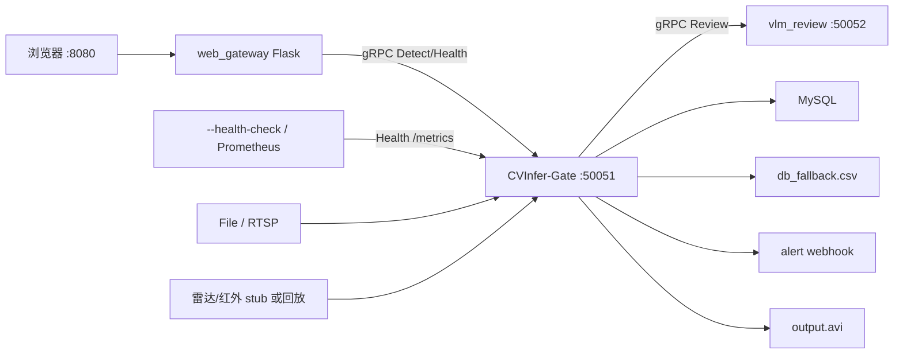
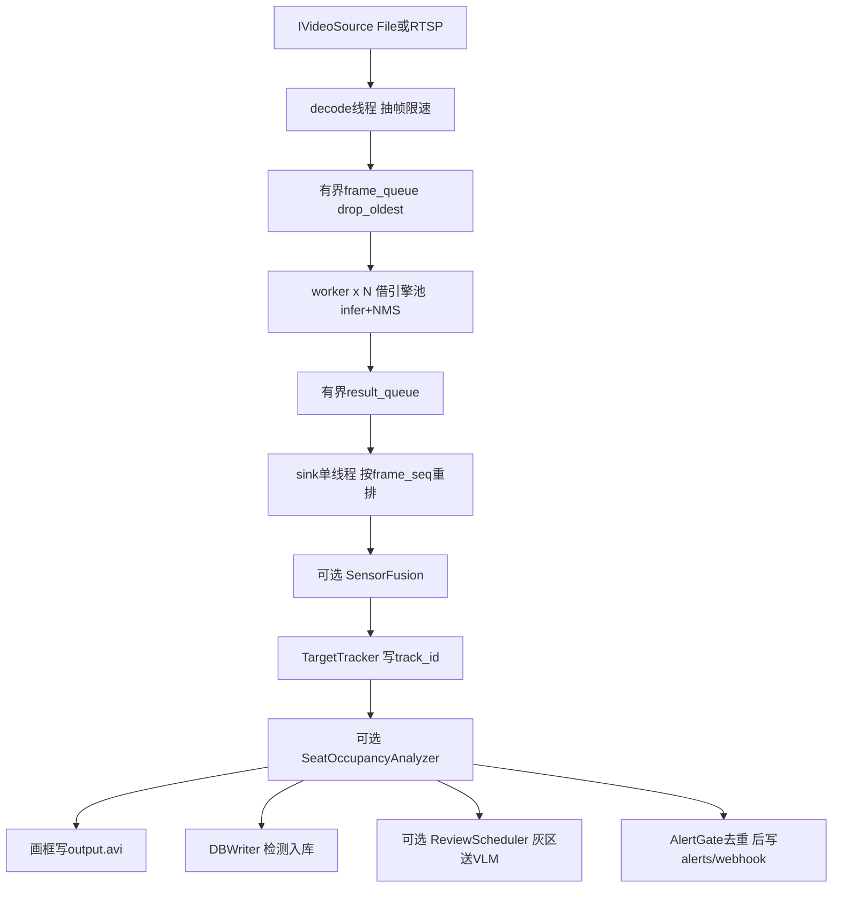

# CVInfer-Gate 架构梳理

## 项目是什么

面向图书馆/自习室占座（默认）和安防/工地一类场景的 **单机 AI 推理网关**：

- **算力核心**：C++17 + OpenVINO（CPU YOLO），手写 NMS，有界队列背压
- **对外接口**：gRPC `DetectionService`（默认 `:50051`）
- **浏览器入口**：Python Flask BFF [`web_gateway/`](web_gateway/)（HTTP ⇄ gRPC）
- **持久化**：MySQL 异步批量写；连不上则降级 `db_fallback.csv` 并自动回连回传
- **可选增强**（默认可关，关掉后与纯视觉链路一致）：级联分类、异步 VLM 复核、雷达/红外融合、占座规则层

装配唯一入口是 [`src/main.cpp`](src/main.cpp)：具体实现类只在这里被构造；其余模块只依赖抽象头（`IVideoSource` / `IDetector` / `ISensorSource` / `IReviewService`）。

已有文档：[`docs/OVERVIEW.md`](docs/OVERVIEW.md)（总览）、[`docs/DEPENDENCY_MAP.md`](docs/DEPENDENCY_MAP.md)（编译依赖）、[`docs/READING_MAP.md`](docs/READING_MAP.md)（按文件读代码）。下文是同一套事实的浓缩版。

---

## 进程与部署边界



[`docker/docker-compose.yml`](docker/docker-compose.yml) 一键拉起 `mysql-db` + `cv-infer-gate`（可再挂 web / vlm）。密钥走 `${VAR}` 展开，不进 yaml 明文。

两条 **proto 方向相反**：

| 契约 | 本仓库角色 | 端口 |
|---|---|---|
| [`proto/inference.proto`](proto/inference.proto) | **服务端** | 50051 |
| [`proto/review.proto`](proto/review.proto) | **客户端** | 50052 |

---

## 运行时数据流（帧的一生）

[`VideoPipeline`](src/pipeline/VideoPipeline.h) 是三阶段流水线，**不认识** DB / 告警 / gRPC；出口全靠 `main` 注入的 sink 回调。



背压不变量：队列有界 + `drop_oldest` → 算力不够时丢旧帧，延迟不无限堆积。

**sink 必须单线程 + 帧序单调**：跟踪、占座、告警去重都有状态，并发会串号。多 worker 乱序由 sink 重排缓冲消化。

gRPC `Detect` **不走这条视频流水线**：浏览器上传的单图在 [`DetectionServiceImpl`](src/service/DetectionServiceImpl.cpp) 里直接向同一 `IDetector` / 引擎池借引擎推理（与流水线共享池，避免单 `InferRequest` 数据竞争）。

---

## 分层（编译期依赖无环）

从底到顶（箭头 = include 方向）：

1. **L2 地基** [`src/utils/`](src/utils/)：配置、日志轮转、生命周期/信号、有界队列、指标、HTTP、ROI、告警去重。不依赖业务模块。
2. **L3 采集** [`src/video/`](src/video/) + [`src/sensor/`](src/sensor/)：文件 / FFmpeg RTSP；传感器统一 `ISensorSource`（视频适配、雷达/红外回放或 stub）。
3. **L4 调度** [`src/pipeline/`](src/pipeline/)：`VideoPipeline` + `MultiSensorPipeline`（传感器 poller + 时间缓冲）。
4. **L5 推理** [`src/inference/`](src/inference/)：`IModel`/`IDetector`/`IClassifier` → `ModelFactory` + `ModelPoolManager`（每模型独立引擎池）→ `OpenVINOEngine` + YOLO/分类后处理。跨模块数据契约是 [`DetectionResult.h`](src/inference/DetectionResult.h)。
5. **L6 可选能力**
   - Phase B：[`CascadeEngine`](src/inference/CascadeEngine.h) 只把灰区交 [`BehaviorClassifier`](src/inference/BehaviorClassifier.h)
   - Phase C：[`review/`](src/review/) 异步 gRPC 复核
   - Phase D：[`fusion/SensorFusion`](src/fusion/SensorFusion.h) 时间对齐 + 关联 + 加权置信度
6. **L7 规则/状态** [`TargetTracker`](src/tracking/TargetTracker.h)、[`SeatOccupancyAnalyzer`](src/occupancy/SeatOccupancyAnalyzer.h)、`AlertGate`
7. **L8/L9 出口与服务** [`database/`](src/database/)、[`alert/`](src/alert/)、[`service/`](src/service/)（鉴权 `AuthGuard`、gRPC 装配、`/metrics`）

Phase A–D **不是串行步骤**，是挂在同一条流水线上的开关层。配置入口只有两个：[`config/config.example.yaml`](config/config.example.yaml)（运行）与 [`config/model_config.yaml`](config/model_config.yaml)（模型 `role`）。

---

## 推理抽象（Phase A 的价值）

```text
model_config.yaml  role=detector/classifier
        │
        ▼
ModelPoolManager ──每模型── InferenceEnginePool ── OpenVINOEngine
        │
        ├── primaryDetector() → YoloDetector
        └── cascade.enabled → CascadeEngine(YoloDetector + BehaviorClassifier)
        │
        ▼
流水线 worker / gRPC Detect  只依赖 IDetector
```

换模型、开级联，不必改 `VideoPipeline` / `DetectionServiceImpl`。

---

## 线程与关闭顺序

| 线程 | 职责 |
|---|---|
| main | 装配、`waitUntilShutdown` |
| decode / workers / sink | 流水线三阶段 |
| DBWriter | 批量写库 / 降级 CSV |
| gRPC server | Detect + Health |
| review workers | 异步复核 |
| 每传感器 1 | `rate_hz` 采样 |
| metrics HTTP | `/metrics` `/healthz`（默认关） |
| alert push | webhook 队列（默认关） |
| signal watcher | SIGINT/TERM → 优雅停 |

停机顺序（`LifecycleCoordinator`）：metrics → pipeline/fusion → alert 排空 → DB flush → gRPC。不要 `kill -9`，否则未推送 webhook 会丢（账在 DB）。

---

## 外围与测试

- **Web**：[`web_gateway/app.py`](web_gateway/app.py) — 单图 `POST /api/detect`；结果回看转码 `output.avi` + 日志事件时间线
- **VLM 服务端**：[`vlm_review/`](vlm_review/) — openai / transformers / mock
- **测试**：`phase_selftest`（零外部依赖、四层替身）；`tests/unit/` gtest（NMS/融合/队列/去重/跟踪/占座/鉴权/指标）；**主干流水线 / 落库 / gRPC 服务仍无自动化**
- **构建**：CMake `GLOB_RECURSE src/*.cpp` —— 新增 `.cpp` 必须重跑 cmake

---

## 读代码建议路径

1. [`src/main.cpp`](src/main.cpp) 装配块 + sink lambda（业务真正发生的地方）
2. [`VideoPipeline.h`](src/pipeline/VideoPipeline.h) 三队列三循环
3. [`IModel.h`](src/inference/IModel.h) + [`ModelPoolManager`](src/inference/ModelPoolManager.h)
4. 按需：级联 / `ReviewScheduler` / `SensorFusion` / occupancy
5. [`DetectionServiceImpl`](src/service/DetectionServiceImpl.cpp) 与 web_gateway 对照 proto

